# ☕ Bean-to-Cup: The Autonomous Barista Swarm

**Bean-to-Cup** is a comprehensive Gemini CLI extension designed to automate the entire Software Development Lifecycle (SDLC). It transforms the AI from a simple code generator into a structured **Autonomous Brewing Team** (Blueprint Forge) that follows a rigorous, multi-phase protocol to deliver high-quality, verified software.


This is a collection of AI-assisted development techniques, steps, and methods I have been experimenting with and building up over the last year. It is always evolving, and the space is evolving very quickly.

---

## 📖 Core Philosophy: "The Perfect Brew"

Just as a master barista follows a precise recipe—from selecting the beans to the final pour—this extension treats software features as "Brews." It enforces a strict **State Machine** based on the "Document-as-Context" architecture, where Markdown files act as the API for your AI agents.


This extension is a formal implementation of the **QRSPI method** (Questions, Research, Structure, Plan, Implement). This workflow, pioneered as the RPI technique by **Dex Horthy** at HumanLayer and evolved into an emerging approach for agentic pipelines, ensures that the human remains the "director" while the AI handles the "execution." It is designed to prevent "outsourcing thinking" by creating high-fidelity checkpoints where you and the AI must align.

### The AI-Native SDLC Stack
This extension implements emerging standards for AI-assisted development:


| SDLC Phase | Standard / Convention | Artifact File | extension Role |
| :--- | :--- | :--- | :--- |
| **Product** | AI-PRD | `01_PRD.md` | Machine-parsable requirements & non-goals. |
| **Extraction** | Context Mapping | `02_EXTRACTION.md` | Factual codebase mapping (Blind Research). |
| **Technical** | SPEC / design.md | `03_SPEC.md` | Tech spec aligned with local `design.md`. |
| **Implementation** | Sequential Plan | `04_PLAN.md` | Phased execution roadmap. |
| **Verification** | Audit & Cupping | `05_VERIFICATION.md` | Static & dynamic verification results. |
| **Delivery** | Service Walkthrough | `06_WALKTHROUGH.md` | Visual & technical proof of success. |

---

### 🛡️ Spec-Driven Development (SDD)

Transitioning to SDD requires a shift in how you work with agents. If specifications are too long or vague, the agent will "drift" or experience context loss. This extension enforces these SDD tenets:

#### A. Prioritize Human Reviewability
The "fundamental test" of a spec is whether a human can review it effectively. If a specification change is too long to review in 5 minutes, the feature is too large. We keep specifications concise and focused on intentionality.

#### B. Solve the "Lost in the Middle" Problem
LLMs often struggle with information buried in the middle of long documents. We keep `03_SPEC.md` and `04_PLAN.md` files modular and use **Plan Mode** guardrails to iterate in a read-only state before generating any code.

#### C. Use "Boundary Specs" (What NOT to build)
Agents are prone to "over-implementing." Our artifacts explicitly list **Constraints** and **Non-Goals** (e.g., "Do not upgrade existing dependencies" or "Do not add authentication logic") to prevent scope drift.

#### D. Agentic Validation (Evals)
Don't just write tests; write Evals. In your `03_SPEC.md`, we define what "Success" looks like for the AI using measurable criteria (SLIs/SLOs), such as "The generated API must have a response time < 100ms."

---

## 🏗️ Architectural Overview

### The 9-Phase Protocol (The State Machine)
The extension follows a rigorous 9-phase protocol to move from initial idea to a verified Pull Request.

```mermaid
flowchart TD
    %% Define Google Colors for Sketchnote Style
    classDef default fill:#f9f9f9,stroke:#333,stroke-width:2px,color:#333;
    classDef phase fill:#ffffff,stroke:#4285F4,stroke-width:2px,color:#333;
    classDef human fill:#ffffff,stroke:#EA4335,stroke-width:2px,color:#333,stroke-dasharray: 5 5;
    classDef agent fill:#ffffff,stroke:#34A853,stroke-width:2px,color:#333;
    classDef artifact fill:#ffffff,stroke:#FBBC05,stroke-width:2px,color:#333;
    classDef orchestrator fill:#ffffff,stroke:#4285F4,stroke-width:3px,color:#333;

    Start((Start: /feature)) --> P1

    subgraph "Phase 1: Strategic Discovery"
        P1[Orchestration Engine: Chat & Clarify]:::orchestrator
        H1{Human Approval}:::human
        A1[\01_PRD.md\]:::artifact
        P1 --> H1
        H1 -- Approve --> A1
    end

    subgraph "Phase 2: Research Briefing"
        A1 --> P2
        P2[Orchestration Engine: Generate Brief]:::orchestrator
        R_Brief[\Research Brief\]:::artifact
        P2 --> R_Brief
    end

    subgraph "Phase 3: Factual Research"
        R_Brief --> P3
        P3[/Dispatch Specialized Engines\]:::agent
        P3_1(Context Mapping)
        P3_2(Codebase Analysis)
        P3_3(Pattern Finder)
        P3 --> P3_1 & P3_2 & P3_3
        P3_1 & P3_2 & P3_3 --> A2[\02_EXTRACTION.md\]:::artifact
    end

    subgraph "Phase 4: Design"
        A1 & A2 --> P4
        P4[/Dispatch @architect\]:::agent
        A3[\03_SPEC.md\]:::artifact
        P4 --> A3
    end

    subgraph "Phase 5: Structure & Planning"
        A3 --> P5
        P5[/Dispatch @architect\]:::agent
        A4[\04_PLAN.md\]:::artifact
        P5 --> A4
    end

    subgraph "Phase 6: Human Review Gate"
        A4 --> H2{Human Approval}:::human
    end

    subgraph "Phase 7: Implementation Loop"
        H2 -- Approve --> L_Start((Start Loop))
        L_Start --> P7_1
        P7_1[/Dispatch @engineer\]:::agent
        P7_2[/Dispatch @auditor\]:::agent
        P7_1 --> P7_2
        
        P7_2 -- "Fail (Code)" --> P7_1
        P7_2 -- "Fail (Plan)" --> P5
        P7_2 -- "Pass" --> P7_3
        
        P7_3[Orchestration Engine: Update Plan]:::orchestrator
        H3{Human Approval: Commit?}:::human
        P7_3 --> H3
        H3 -- Approve --> P7_4[(Git Commit)]
        
        P7_4 -- "More Tasks" --> L_Start
        P7_4 -- "All Done" --> A5[\05_VERIFICATION.md\]:::artifact
    end

    subgraph "Phase 8: Walkthrough"
        A5 --> P8
        P8[/Dispatch @browser_agent\]:::agent
        A6[\06_WALKTHROUGH.md\]:::artifact
        P8 --> A6
    end

    subgraph "Phase 9: Delivery"
        A6 --> P9
        P9[Orchestration Engine: Push & PR]:::orchestrator
        End((Pull Request Created))
        P9 --> End
    end
```



### 1. The Head Barista (Supervisor) [CORE]
The heart of the extension is the `bean-to-cup.md` file. It acts as the **Head Barista** and **Guardian of the Protocol**. It ensures that "Intent" (PRD) is separated from "Extraction" (Research) to prevent bias.

**Key Mandates:**
*   **PRD over Specs:** Every feature starts with a machine-parsable `01_PRD.md` including **Non-Goals** and **SLIs/SLOs**.
*   **UI/UX Alignment:** The Architect (@architect) explicitly searches for an existing `design.md` in your root to ensure UI/UX consistency.
*   **SRE-Ready:** Requirements include initial telemetry and monitoring constraints for Day 2 operations.

---

## 🤖 The Brewing Swarm (Agents)

Invoke specialized sub-agents using `@<name>` in your prompts:

| Agent | Role | Expertise | Status |
| :--- | :--- | :--- | :--- |
| **`@architect`** | The Planner | Design patterns, Spec generation, and UI/UX alignment. | **CORE** |
| **`@engineer`** | The Builder | TDD implementation and production code. | **CORE** |
| **`@auditor`** | The Gatekeeper | Verification, Cupping, and protocol enforcement. | **CORE** |
| **`@scout`** | The Investigator | Factual codebase mapping and technical extraction. | **CORE** |
| **`@browser_agent`** | The Browser | Automated UI walkthroughs and visual verification. | **CORE** |
| **`@codebase-analyzer`** | The Cartographer | Deep surgical analysis of implementation details. | **CORE** |
| **`@codebase-locator`** | The Navigator | Rapidly mapping component locations. | **CORE** |
| **`@codebase-pattern-finder`** | The Librarian | Finding existing code examples and patterns. | **CORE** |
| **`@security-auditor`** | The Sentry | Hunting for vulnerabilities and logic flaws. | **CORE** |
| **`@code-review`** | The Critic | Deep architectural and logic reviews. | **CORE** |
| **`@msbuild`** | The Compiler | MSBuild and .NET specialized compilation tasks. | **CORE** |
| **`@pipeline-expert`** | The CI/CD | Pipeline stages and delivery automation. | **CORE** |

---

## ⌨️ Custom Commands

### Core Lifecycle
*   **`/feature <goal>`** [CORE]: Initiates the 9-phase protocol starting with an AI-Ready PRD.
*   **`/research <query>`** [CORE]: Spawns parallel agents for deep, factual technical extraction.
*   **`/loop:start`** [CORE]: Starts an infinite, self-correcting development loop (Ralph).

### Workspace Management
*   **`/brew:init`** [CORE]: Bootstraps your project by copying the protocol to `.gemini/system.md`.
*   **`/brew:archive`** [CORE]: Clears away 'spent grounds' (completed tasks) to keep context clean.
*   **`/dev <task>`** [CORE]: General-purpose development helper for quick tasks.
*   **`/startcycle`** [CORE]: Logic for starting or resuming development cycles.

### Specialized Pipelines
*   **`/sql:analyze`** [CORE]: Deep analysis of legacy stored procedures and schema.
*   **`/ddd:*`** [CORE]: A 7-step pipeline (`logical`, `physical`, `plan`, `implement`, `review`, `fix`, `create-user-stories`) for SQL-to-DDD refactoring.
*   **`/test:api`** [CORE]: Specialized API testing and validation pipeline.
*   **`/build:production`** [CORE]: Production-ready build and packaging automation.

---

## 🛠️ Reusable Skills & Hooks

### Skills
*   **`write-specs`** [CORE]: Transforming ideas into rigorous requirements (Phase 1).
*   **`github-workflow`** [CORE]: Standardized PR creation using `gh` (Phase 9).
*   **`chaos-mitigation`** [CORE]: SRE/Ops troubleshooting based on logs and runbooks.
*   **`audit-code`** [CORE]: Automated quality gates and architectural compliance checks.
*   **`deploy-app`** [CORE]: Environment deployment and orchestration.
*   **`generate-code`** [CORE]: Boilerplate and scaffolding generation for common patterns.

### Automated Hooks
*   **`lint-on-change`** [CORE]: Automatically runs your linter whenever a file is modified.
*   **`coffee-and-git`** [CORE]: Provides a coffee tip and git history at session start.
*   **`git-status`** [CORE]: Keeps your current branch and workspace state visible.

---

## 🚀 Installation & Quickstart

1.  **Install the Extension**:
    ```bash
    gemini extensions install https://github.com/sapientcoffee/bean-to-cup
    ```

2.  **Initialize your Workspace**:
    ```bash
    /brew:init
    ```

3.  **Start your first Brew**:
    ```bash
    /feature "Add a search bar to the coffee bean catalog"
    ```

---

**Credits**: [@dandobrin](https://github.com/dandobrin), [@jjdelorme](https://github.com/jjdelorme), [@cedricyao](https://github.com/cedricyao), [Dex Horthy](https://x.com/dexhorthy).

*Created with ❤️ for demo/example pruposes only.*
