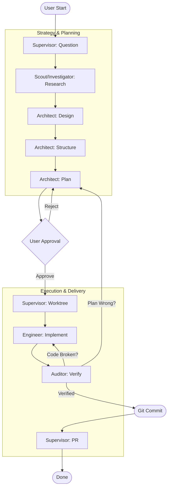

ork in progess and experimenting - do not use yet!!


# Bean-to-Cup (Blueprint Forge)

A comprehensive Gemini CLI Extension that provides a **Multi-Agent Swarm** for autonomous software development, alongside specialized, step-by-step commands for **SQL-to-DDD Refactoring**.

**See** [Gemini CLI Extensions](https://github.com/google-gemini/gemini-cli/blob/main/docs/extensions/index.md) for more details.

**Credits**: [@dandobrin](https://github.com/ddobrin), [@jjdelorme](https://github.com/jjdelorme) & [@cedricyao](https://github.com/cedricyao). Parts of this work were adapted from Dan's [production serverless repository](https://github.com/GoogleCloudPlatform/serverless-production-readiness-java-gcp/tree/main/genai/quotes-llm/.gemini/commands).

## Prerequisites
Install the [Gemini CLI](https://github.com/google-gemini/gemini-cli)

## Extension Installation
From your command line:

```bash
gemini extensions install https://github.com/sapientcoffee/bean-to-cup
```

### Activating the Swarm Supervisor (Per-Workspace)

While the agents (`architect`, `engineer`, `auditor`) are installed globally by the extension, the **Supervisor** (`system.md`) must be activated locally in each project you want to use it in.

1. Navigate to your project directory.
2. Run the initialization command:
   ```bash
   /swarm:init
   ```
   *(This downloads the `system.md` file into your local `.gemini/` folder).*
3. **Restart** the Gemini CLI with the system override enabled:
   ```bash
   GEMINI_SYSTEM_MD=true gemini
   ```

---

## 🤖 1. The Autonomous Swarm

Bean-to-Cup is a portable, framework-agnostic AI agent swarm (Blueprint Forge) designed to manage the software development lifecycle using a rigorous **Plan -> Act -> Verify** state machine.

### The Agents
*   **Supervisor (`system.md`)**: The Project Manager. Enforces the state machine, manages hand-offs, and gates Git commits.
*   **Architect (`architect`)**: The Planner. Reads research, creates comprehensive step-by-step TDD implementation plans in the `plans/` directory.
*   **Engineer (`engineer`)**: The Builder. Strictly follows the Architect's plans, writing tests and implementing changes via Red-Green-Refactor.
*   **Auditor (`auditor`)**: The Gatekeeper. Verifies the Engineer's work. Compiles code, runs tests, and hunts for lazy AI shortcuts (TODOs, commented-out tests).

### 🔄 Protocol Lifecycle
The system moves through distinct phases, enforced by the Supervisor.



### Workspace Maintenance: Archiving Plans
As the Swarm executes tasks, your `plans/` directory will accumulate executed task files, research reports, and review feedback. To keep the agent's context window clean and focused, you can archive completed items:

```bash
/swarm:archive
```
**What it does:**
1. Reads your Master Roadmap to identify completed campaigns and tasks.
2. Moves all corresponding completed files into a `plans/archive/` directory.
3. Automatically updates your project's `.geminiignore` to ensure archived files are hidden from the AI's context in future turns.

### Extending the Swarm (Optional)
The core swarm is agnostic. To add deep codebase intelligence (like a Graph Database), install a specialized skill/agent in your project and update your project's `GEMINI.md` to instruct the swarm to use it:

```markdown
# Swarm Routing & Delegation Rules (Add to your project's GEMINI.md)
- For codebase investigation, you MUST delegate to the `scout` agent. Do NOT use the built-in investigator.
- The `auditor` agent MUST utilize the `graphdb` skill for verifying changes.
```

---

## 🏗️ 2. DDD Refactoring Commands
A specialized workflow for refactoring legacy code (specifically SQL) into a modern **.NET, Domain-Driven Design (DDD)** architecture.

**Architecture:** .NET 10, C# 14, MediatR (CQRS), EF Core (Code-First).
**Methodology:** Domain-Driven Design (DDD) via Test-Driven Development (TDD).

### The Workflow
**CRITICAL:** This pipeline is state-sensitive. After every step, review the output artifact, then type `/clear` to reset the context window to prevent "Context Pollution."

#### Step 0: User Story Generation (Optional)
*Generates agile user stories from existing code to help understand the current system.*
*   **Command:** `/ddd:create-user-stories {{path/to/code}}`
*   **Output:** `user-stories.md`

#### Step 1: Deep Analysis (SQL)
*Deep analysis of legacy Stored Procedures. Extracts business rules, data dictionaries, and test cases.*
*   **Command:** `/sql:analyze {{path/to/legacy_proc.sql}}`
*   **Output:** `ANALYSIS_[ProcName].md`

#### Step 2: Logical Architecture
*Transforms the Analysis into a pure Domain Model (Aggregates, Entities, Rules).*
*   **Command:** `/ddd:logical {{ANALYSIS_[ProcName].md}}`
*   **Output:** `LOGICAL_ARCHITECTURE.md`

#### Step 3: Physical Architecture
*Maps the Domain Model to .NET 10, MediatR, and EF Core patterns.*
*   **Command:** `/ddd:physical {{LOGICAL_ARCHITECTURE.md}}`
*   **Output:** `PHYSICAL_ARCHITECTURE.md`

#### Step 4: Implementation Planning
*Generates a step-by-step TDD execution plan.*
*   **Command:** `/ddd:plan {{PHYSICAL_ARCHITECTURE.md}}`
*   **Output:** `IMPLEMENTATION_PLAN.md`

#### Step 5: Build & Implementation
*Executes the plan using strict Red-Green-Refactor TDD.*
*   **Command:** `/ddd:implement {{IMPLEMENTATION_PLAN.md}}`
*   **Output:** Actual C# code in `src/` and tests in `tests/`.

### The Quality Assurance Loop
Once the code is built, do not ship it. Enter the **Review/Fix Loop**.

#### Step 6: Code Review (Quality Gate)
*Audits the code for "Laziness", Stubbing, and missing Business Rules.*
*   **Command:** `/ddd:review`
*   **Output:** `REVIEW_REPORT.md` (Look for `🔴 REJECT` or `🟢 PASS`)

#### Step 7: Remediation (Self-Healing)
*If Step 6 failed, this command fixes the specific issues listed in the report.*
*   **Command:** `/ddd:fix {{REVIEW_REPORT.md}}`
*   **Next Step:** Go back to **Step 6** (`/ddd:review`). Repeat until **PASS**.