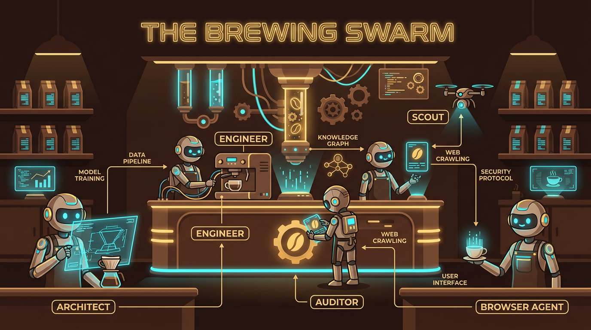
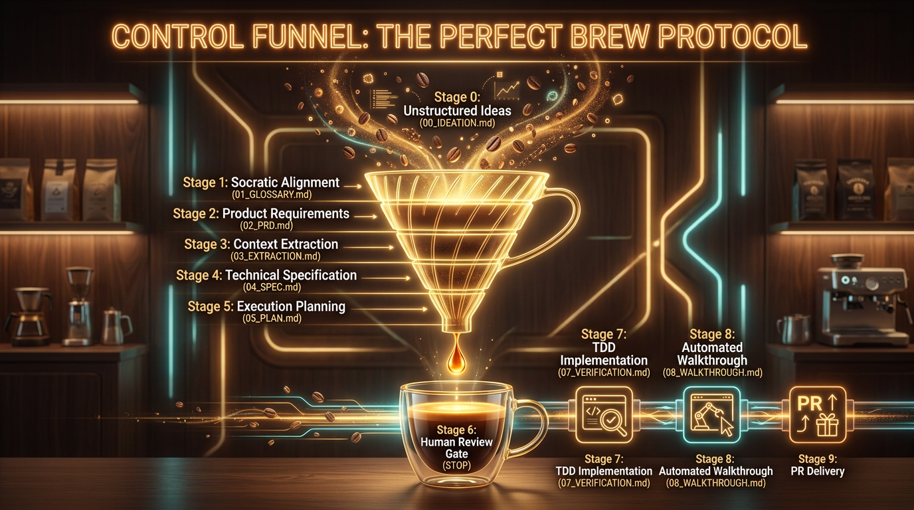
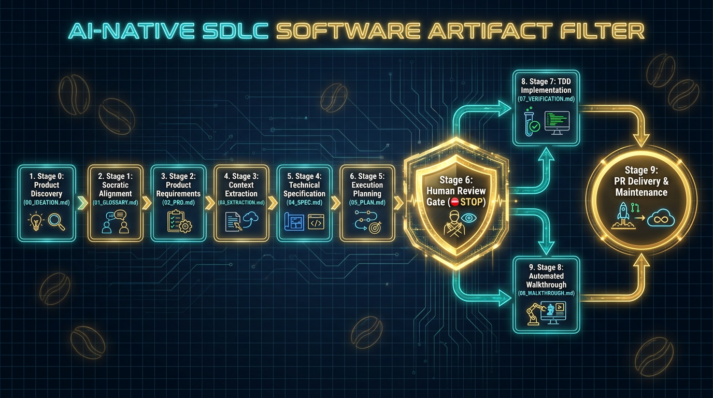

> [!WARNING]
> **Demo/Illustrative Purpose Only**: This project is intended for inspiration and demonstration of AI-assisted development techniques. It should **not** be deployed to production environments without thorough testing, security audits, and validation. Use as a starting point for your own implementations.

# ☕ Bean-to-Cup: The Autonomous Barista Swarm

**Bean-to-Cup** is a comprehensive Gemini CLI extension designed to automate the entire Software Development Lifecycle (SDLC). It transforms the AI from a simple code generator into a structured **Autonomous Brewing Team** (Blueprint Forge) that follows a rigorous, multi-phase protocol to deliver high-quality, verified software.



This is a collection of AI-assisted development techniques, steps, and methods I have been experimenting with and building up over the last year. It is always evolving, and the space is evolving very quickly.

---

## 📖 Core Philosophy: "The Perfect Brew"

Just as a master barista follows a precise recipe—from selecting the beans to the final pour—this extension treats software features as "Brews." It enforces a strict **State Machine** based on the "Document-as-Context" architecture, where Markdown files act as the API for your AI agents.



This extension is a formal implementation of the **QRSPI method** (Questions, Research, Structure, Plan, Implement). This workflow combines the **RPI technique** (pioneered by **Dex Horthy** at HumanLayer) and the **Socratic Spec / AI-assisted product design** philosophies (pioneered by **Matt Pocock** at [AI Hero](https://www.aihero.dev/)). Together, these evolved into a state-of-the-art agentic pipeline protocol that ensures the human remains the "director" while the AI handles the "execution." It is designed to prevent "outsourcing thinking" by creating high-fidelity checkpoints where you and the AI must align.

### The AI-Native SDLC Stack
This extension implements emerging standards for AI-assisted development:



| SDLC Stage | Standard / Convention | Artifact File | extension Role |
| :--- | :--- | :--- | :--- |
| **Stage 0 (Optional)** | Product Discovery | `00_IDEATION.md` | Formulate raw ideas, persona friction, and data schemas. |
| **Stage 1** | Socratic Alignment | `01_GLOSSARY.md` | Engage in Socratic interview & Ubiquitous Glossary. |
| **Stage 2** | Product Requirements | `02_PRD.md` | Machine-parsable requirements, NFRs, & non-goals. |
| **Stage 3** | Context Extraction | `03_EXTRACTION.md` | Factual codebase mapping (Blind Research). |
| **Stage 4** | Technical Specification | `04_SPEC.md` | Tech spec, Threat Model, SRE telemetry. |
| **Stage 5** | Execution Planning | `05_PLAN.md` | Slices, TDD checklist, & physical contracts. |
| **Stage 6** | Human Review Gate | *None (Halt)* | STOP. Verify contracts & specs before implementation. |
| **Stage 7** | Test-Driven Implementation | `07_VERIFICATION.md` | Incrementally execute code under TDD loop. |
| **Stage 8** | Automated Walkthrough | `08_WALKTHROUGH.md` | Visual & technical browser-based proof. |
| **Stage 9** | PR Delivery & Maintenance | *PR Description* | Push branch, submit PR with walkthrough report. |

---

### 🛡️ Spec-Driven Development (SDD)

Transitioning to SDD requires a shift in how you work with agents. If specifications are too long or vague, the agent will "drift" or experience context loss. This extension enforces these SDD tenets:

#### A. Prioritize Human Reviewability
The "fundamental test" of a spec is whether a human can review it effectively. If a specification change is too long to review in 5 minutes, the feature is too large. We keep specifications concise and focused on intentionality.

#### B. Solve the "Lost in the Middle" Problem
LLMs often struggle with information buried in the middle of long documents. We keep `04_SPEC.md` and `05_PLAN.md` files modular and use **Plan Mode** guardrails to iterate in a read-only state before generating any code.

#### C. Use "Boundary Specs" (What NOT to build)
Agents are prone to "over-implementing." Our artifacts explicitly list **Constraints** and **Non-Goals** (e.g., "Do not upgrade existing dependencies" or "Do not add authentication logic") to prevent scope drift.

#### D. Agentic Validation (Evals)
Don't just write tests; write Evals. In your `04_SPEC.md`, we define what "Success" looks like for the AI using measurable criteria (SLIs/SLOs), such as "The generated API must have a response time < 100ms."

---

## 🏗️ Architectural Overview

### The 9-Phase Protocol (The State Machine)
The extension follows a rigorous 9-phase protocol to move from initial idea to a verified Pull Request.

```mermaid
flowchart TD
    %% Style Classes Definition
    classDef default fill:#f9f9f9,stroke:#333,stroke-width:2px,color:#333;
    classDef stage fill:#ffffff,stroke:#4285F4,stroke-width:2.5px,color:#333,font-weight:bold;
    classDef user fill:#eef2ff,stroke:#6366f1,stroke-width:2px,color:#312e81,font-weight:bold;
    classDef component fill:#f0fdf4,stroke:#16a34a,stroke-width:2px,color:#14532d;
    classDef artifact fill:#fffbeb,stroke:#d97706,stroke-width:2px,color:#78350f,font-style:italic;
    classDef gate fill:#fef2f2,stroke:#dc2626,stroke-width:2.5px,color:#991b1b,font-weight:bold;

    %% STAGE 0: PRODUCT DISCOVERY
    subgraph S0 ["Stage 0: Product Discovery (Optional)"]
        S0_Title["Stage 0: Discovery"]:::stage
        U0["User Types:<br>Brainstorm / request"]:::user
        I0["Input:<br>Initial Prompt"]:::default
        C0["Skill: ideator"]:::component
        A0["Output:<br>00_IDEATION.md"]:::artifact
        
        U0 --> C0
        I0 --> C0
        C0 --> A0
    end

    %% STAGE 1: SOCRATIC ALIGNMENT
    subgraph S1 ["Stage 1: Socratic Alignment"]
        S1_Title["Stage 1: Socratic Alignment"]:::stage
        U1["User Types:<br><b>/feature [goal]</b><br>+ Answers Socratic Qs"]:::user
        I1["Input:<br>00_IDEATION.md (Optional)"]:::artifact
        C1["Skills: grill, grilling,<br>domain-modeling"]:::component
        A1["Output:<br>01_GLOSSARY.md<br>(Glossary + ADRs)"]:::artifact
        
        A0 -.-> I1
        U1 --> C1
        I1 --> C1
        C1 --> A1
    end

    %% STAGE 2: PRODUCT REQUIREMENTS
    subgraph S2 ["Stage 2: Product Requirements"]
        S2_Title["Stage 2: Product Requirements"]:::stage
        U2["User Action:<br>Reviews PRD in chat UI"]:::user
        I2["Input:<br>01_GLOSSARY.md"]:::artifact
        C2["Skill: write-prd"]:::component
        A2["Output:<br>02_PRD.md<br>(Non-goals & KPIs)"]:::artifact
        
        A1 --> I2
        U2 -.-> C2
        I2 --> C2
        C2 --> A2
    end

    %% STAGE 3: CONTEXT EXTRACTION
    subgraph S3 ["Stage 3: Context Extraction"]
        S3_Title["Stage 3: Context Extraction"]:::stage
        U3["User Action:<br>Approves PRD<br>(or types <b>/research [query]</b>)"]:::user
        I3["Input:<br>02_PRD.md / query"]:::artifact
        C3["Command: <b>/research</b><br>➔ Skill: research<br>➔ Subagents: @scout,<br>@context-mapping,<br>@codebase-analyzer,<br>@pattern-recognition"]:::component
        A3["Output:<br>03_EXTRACTION.md<br>(Factual Code Map)"]:::artifact
        
        A2 --> I3
        U3 --> C3
        I3 --> C3
        C3 --> A3
    end

    %% STAGE 4 & 5: TECH SPEC & EXECUTION PLAN
    subgraph S45 ["Stages 4 & 5: Spec & Plan"]
        S45_Title["Stages 4 & 5: Spec & Plan"]:::stage
        U45["User Action:<br>None (Automated)"]:::user
        I45_1["Input 1:<br>02_PRD.md"]:::artifact
        I45_2["Input 2:<br>03_EXTRACTION.md"]:::artifact
        C45["Subagent: @architect<br>(system-design.md)"]:::component
        A4["Output:<br>04_SPEC.md (Contracts)"]:::artifact
        A5["Output:<br>05_PLAN.md (Checklist)"]:::artifact
        
        A2 -.-> I45_1
        A3 --> I45_2
        I45_1 --> C45
        I45_2 --> C45
        C45 --> A4
        C45 --> A5
    end

    %% STAGE 6: HUMAN GATE
    subgraph S6 ["Stage 6: Human Review Gate"]
        S6_Title["Stage 6: Human Gate"]:::gate
        U6["User Action:<br>Reviews 04_SPEC contracts<br>and types <b>'approve'</b>"]:::user
        I6_1["Input 1:<br>04_SPEC.md"]:::artifact
        I6_2["Input 2:<br>05_PLAN.md"]:::artifact
        
        A4 --> I6_1
        A5 --> I6_2
        I6_1 --> U6
        I6_2 --> U6
    end

    %% STAGE 7: TEST-DRIVEN IMPLEMENTATION
    subgraph S7 ["Stage 7: Test-Driven Implementation (TDD)"]
        S7_Title["Stage 7: TDD Loop"]:::stage
        U7["User Action:<br>Approves milestone commits<br>(Types 'yes' / 'approve')"]:::user
        I7_1["Input 1:<br>04_SPEC.md (Contracts)"]:::artifact
        I7_2["Input 2:<br>05_PLAN.md (Checklist)"]:::artifact
        C7["Subagents: @engineer, @auditor,<br>@code-review<br>➔ Skills: generate-code, audit-code,<br>kanban, deploy-app<br>➔ Hook: lint-on-change.sh"]:::component
        A7["Outputs:<br>- Working verified code<br>- 07_VERIFICATION.md (Logs)"]:::artifact
        
        U6 -->|Approved| C7
        A4 -.-> I7_1
        A5 -.-> I7_2
        I7_1 --> C7
        I7_2 --> C7
        U7 -.-> C7
        C7 --> A7
    end

    %% STAGE 8: AUTOMATED WALKTHROUGH
    subgraph S8 ["Stage 8: Automated Walkthrough"]
        S8_Title["Stage 8: Walkthrough"]:::stage
        U8["User Types:<br><b>/brew:record</b>"]:::user
        I8_1["Input 1:<br>07_VERIFICATION.md"]:::artifact
        I8_2["Input 2:<br>walkthrough_scenario.json"]:::default
        C8["Command: <b>/brew:record</b><br>➔ Skill: asciinema"]:::component
        A8["Output:<br>08_WALKTHROUGH.md<br>(Terminal playbacks / GIF)"]:::artifact
        
        A7 --> I8_1
        U8 --> C8
        I8_1 --> C8
        I8_2 --> C8
        C8 --> A8
    end

    %% STAGE 9: PR DELIVERY & MAINTENANCE
    subgraph S9 ["Stage 9: PR Delivery & Maintenance"]
        S9_Title["Stage 9: Delivery & PR"]:::stage
        U9["User Action:<br>Completes PR review<br>Optionally types:<br><b>/brew:archive</b>, <b>/brew:sync</b>,<br><b>/brew:worktree</b>, <b>/build:production</b>"]:::user
        I9_1["Input 1:<br>Working code"]:::artifact
        I9_2["Input 2:<br>08_WALKTHROUGH.md"]:::artifact
        C9["Skill: github-workflow<br>(creates PR via <b>gh</b> CLI)"]:::component
        A9["Output:<br>Active GitHub PR<br>& clean workspace"]:::artifact
        
        A8 --> I9_2
        U9 --> C9
        I9_1 --> C9
        I9_2 --> C9
        C9 --> A9
    end
```



### 1. The Head Barista (Supervisor) [CORE]
The heart of the extension is the `bean-to-cup.md` file. It acts as the **Head Barista** and **Guardian of the Protocol**. It ensures that "Intent" (PRD) is separated from "Extraction" (Research) to prevent bias.

**Key Mandates:**
*   **PRD over Specs:** Every feature starts with a machine-parsable `02_PRD.md` including **Non-Goals** and **SLIs/SLOs**.
*   **UI/UX Alignment:** The Architect (@architect) explicitly searches for an existing `design.md` in your root to ensure UI/UX consistency.
*   **SRE-Ready:** Requirements include initial telemetry and monitoring constraints for Day 2 operations.

---

## 🤖 The Brewing Swarm (Agents)

The Bean-to-Cup plugin manages an autonomous network of **8 active specialized sub-agents** in the `agents/` directory (plus **5 archived agents** in the holding pen). You can invoke active agents in your chat prompts using `@<name>`. For a detailed description of each agent's config file and target SDLC stage, see the [Swarm & Command Registry](docs/swarm-registry.md#-2-specialized-agents--swarm-13-total).

| Agent | Role | Expertise & Focus | Status |
| :--- | :--- | :--- | :--- |
| **`@architect`** | The Planner | Strategic design patterns, `04_SPEC.md` specs, and `05_PLAN.md` roadmaps. | **CORE (Active)** |
| **`@engineer`** | The Builder | TDD implementation, Red-Green-Refactor, and production logic. | **CORE (Active)** |
| **`@auditor`** | The Gatekeeper | Spec validation, regression checking, and QA cupping. | **CORE (Active)** |
| **`@scout`** | The Investigator | Context-isolated codebase queries and raw context extraction. | **CORE (Active)** |
| **`@browser_agent`** | The Browser | Automated browser walkthroughs and visual UI/UX verification. | **CORE (Active)** |
| **`@codebase-analyzer`** | The Cartographer | Deep structural mapping and component tracing. | **CORE (Active)** |
| **`@context-mapping`** | The Navigator | Entrypoint mapping and rapid workspace discovery. | **CORE (Active)** |
| **`@pattern-recognition`** | The Librarian | Locating and mirroring existing architectural code patterns. | **CORE (Active)** |
| **`@code-review`** | The Critic | Line-by-line quality reviews and static code smells analysis. | **CORE (Active)** |

> [!NOTE]
> **Archived Sentry & Tooling Agents (Holding Pen):**
> The following agents have been safely moved to `holding-pen/agents/` to keep the active workspace clean and efficient:
> - `@security-auditor`, `@security-remediator`, `@vulnerability-scanner` (Sentry group)
> - `@msbuild` (Compiler)
> - `@pipeline-stages` (CI/CD)

---

## ⌨️ Custom Commands

The plugin implements **10 active Custom Commands** mapped as flat namespace TOML declarations in the `commands/` directory.

### Core Lifecycle
*   **`/feature <goal>`** [CORE]: Initiates the 9-phase protocol starting with an AI-Ready PRD and versioned workspace setup.
*   **`/research <query>`** [CORE]: Spawns parallel agents for deep, factual context-isolated codebase extraction.

### Workspace Management & Testing
*   **`/brew:init`** [CORE] *(Deprecated)*: Legacy command to bootstrap your project. This setup is now handled automatically.
*   **`/brew:archive`** [CORE]: Clears away 'spent grounds' (completed tasks) to keep context clean.
*   **`/brew:record`** [CORE]: Launches terminal recording and playback scenario capture.
*   **`/brew:sync`** [CORE]: Synchronizes active branch and plans with upstream repo states.
*   **`/brew:worktree`** [CORE]: Manages clean, isolated branch checkouts for development.
*   **`/dev <task>`** [CORE]: General-purpose development helper for quick, minor inline requests.
*   **`/test:api`** [CORE]: Specialized endpoint testing and compliance checks.
*   **`/build:production`** [CORE]: Packages, compiles, and builds production release artifacts.

> [!NOTE]
> **Archived Pipeline & Loop Commands (Holding Pen):**
> The following commands have been safely archived to the `holding-pen/commands/` directory to prevent workspace clutter:
> - `/loop:start`, `/loop:cancel`, `/loop:help` (Legacy loop control)
> - `/sql:analyze` (Legacy database schema extraction)
> - `/ddd:*` commands: `/ddd:logical`, `/ddd:physical`, `/ddd:plan`, `/ddd:implement`, `/ddd:review`, `/ddd:fix`, `/ddd:create-user-stories` (Legacy refactoring pipeline)
> - `/startcycle` (Legacy cycle manager)

---

## 🛠️ Reusable Skills & Hooks

Each modular skill in the `skills/` directory complies with the open **Agent Skills specification**, enabling deep reuse. For the complete skill-to-stage mappings and execution scripts, see the [Swarm & Command Registry](docs/swarm-registry.md#-3-modular-skills-13-total).

### Skills
*   **`ideator`** [CORE]: **Stage 0 (Optional)**: Generates a product discovery and technical architecture draft from any raw product idea, feature request, or prompt, writing the results to `00_IDEATION.md`.
*   **`grill` / `grilling`** [CORE]: **Stage 1**: Relentless interactive interview and requirements stress-testing.
*   **`domain-modeling`** [CORE]: **Stage 1, 4 & 5**: Builds, refines, and maintains the ubiquitous glossary and domain models.
*   **`write-prd`** [CORE]: **Stage 2**: Standardizes requirements, non-goals, and KPIs into a machine-parsable `02_PRD.md`.
*   **`research`** [CORE]: **Stage 3**: Guides context-isolated codebase extraction into factual `03_EXTRACTION.md`.
*   **`audit-code`** [CORE]: **Stage 7**: Runs architectural compliance checks, QA gates, and executes minor commits.
*   **`generate-code`** [CORE]: **Stage 7**: Generates boilerplate and components according to Spec contracts.
*   **`kanban`** [CORE]: **Stage 7**: Progress tracking (HTML & Mermaid visualizer) for vertical sprint slices.
*   **`chaos-mitigation`** [CORE]: **Stage 7**: Handles SRE log inspection and runs automated mitigation playbooks.
*   **`deploy-app`** [CORE]: **Stage 7**: Resolves dependencies, compiles packages, and serves local webservers.
*   **`github-workflow`** [CORE]: **Stage 9**: Automates branch pushes and PR compilation with the GitHub CLI (`gh`).

### Automated Hooks
*   **`lint-on-change`** [CORE]: Automatically runs your linter whenever a file is modified.
*   **`coffee-and-git`** [CORE]: Provides a coffee tip and git history at session start.
*   **`git-status`** [CORE]: Keeps your current branch and workspace state visible.

---

## 🧪 Testing & Verification

Developing and maintaining an autonomous swarm requires a resilient testing protocol. We have established a comprehensive **5-layer isolation and behavioral testing suite** that operates entirely locally and independently of the Agent Development Kit (ADK).

*   **Isolated Testing Strategy**: See our detailed **[Isolated Testing & Verification Strategy Guide](docs/testing_and_verification.md)** to learn how we isolate workspace states, mock stage inputs, execute deterministic validation gates, and run pseudo-terminal simulations.
*   **End-to-End Audit Evidence**: View our live **[End-to-End Testing & Evaluation Report](docs/test_report.md)** which showcases real test execution traces, negative/positive gating checks, and a full behavior audit of over 700 step logs.

### Why this is set up:
*   **Deterministic Safety (Option 1)**: Traditional unit testing doesn't catch AI-specific failures like bracket placeholder leaks (`[TODO]`), missing licenses, or broken markdown structures.
*   **Behavioral Assurance (Option 2)**: Programmatic transcript checking ensures subagents (such as `@architect` or `@engineer`) are spawned with exactly the correct arguments and that tools execute error-free.
*   **Extreme Velocity**: Input mocking allows testing late stages (like Stage 7 TDD or Stage 8 Walkthrough) in a lightweight sandbox (`scratch/sandbox-app`) in seconds, without having to run through Stages 0 to 6 first.

---

## 🚀 Installation & Quickstart

This repository is **multi-compatible**: it functions seamlessly as a modern **Antigravity Plugin**, a standard **Agent Skills Package** via the `skills` CLI, and a legacy **Gemini CLI Extension**. 

You can use whichever harness or tool matches your workflow; they will coexist peacefully using their respective manifest files (`plugin.json` and `gemini-extension.json`) and standard layouts.

---

### Option A: Running as an Antigravity Plugin (Modern)

Antigravity natively scans your active workspace or user home directory to discover plugins and registers all included subagents, skills, and rules automatically.

We provide an automated, dependency-free Bash installer script (`install.sh`) at the root of the repository to set up the plugin.

#### 1. One-Line Installation (No local clone required)
If you are on a new machine and don't have the repository cloned locally, you can stream the installer directly via `curl` to clone and register the plugin in one step:

*   **Global-Level Installation** (Active across all of your projects):
    ```bash
    curl -sSL https://raw.githubusercontent.com/sapientcoffee/bean-to-cup/main/install.sh | bash
    ```
*   **Workspace-Level Installation** (Active only in the current workspace directory):
    ```bash
    curl -sSL https://raw.githubusercontent.com/sapientcoffee/bean-to-cup/main/install.sh | bash -s -- --workspace
    ```

#### 2. Local Clone Installation (Symlinked for Active Development)
If you are actively developing the plugin, or already have a local clone of this repository, run the installer script from the root of your clone. This creates a **symlink** to your development directory:

*   **Global Symlink** (Registers your local clone for all projects):
    ```bash
    ./install.sh
    ```
*   **Workspace-Level Symlink** (Registers your local clone inside the current project):
    ```bash
    ./install.sh --workspace
    ```

#### 3. How to Update the Plugin (`git pull`)
Updates are clean and simple depending on how the plugin was installed:

*   **If installed via Local Symlink (Development)**:
    Just run `git pull` inside your local clone. Since the plugin directory is symlinked, Antigravity picks up changes instantly.
*   **If installed via One-Line Curl (Direct Clones)**:
    The installer clones the real Git repository directly into the target location. You can fetch updates by navigating into that directory and pulling:
    ```bash
    cd ~/.gemini/skills/bean-to-cup
    git pull
    ```

#### 4. Verify Discovery
Start your Antigravity session. The platform automatically scans `plugin.json` and loads the custom skills and subagents:
*   View your active agents by listing them in your developer panel (or using the `/agents` helper).
*   Any skills inside the `skills/` directory (like `audit-code` or `github-workflow`) are instantly accessible to your active agent.

---

### Option B: Running as a Gemini CLI Extension (Legacy)

#### 1. Install the Extension
You can install or link the extension directly using the Gemini CLI.

**Via GitHub (Recommended):**
```bash
gemini extensions install https://github.com/sapientcoffee/bean-to-cup.git
```

**Via Local Path (For Development):**
```bash
# Clone the repository
git clone https://github.com/sapientcoffee/bean-to-cup.git

# Link the extension
gemini extensions link ./bean-to-cup
```

#### 2. Initialize your Workspace (Deprecated)
> [!NOTE]
> This step is deprecated under Antigravity 2.0. Workspace bootstrapping is now managed automatically upon plugin registration.
>
> If running on legacy Gemini CLI, you can still optionally run:
> ```bash
> /brew:init
> ```

#### 3. Start your first Brew
Begin the 9-phase protocol for a new feature:
```bash
/feature "Add a search bar to the coffee bean catalog"
```

---

### Option C: Installing Individual Skills via the Open Skills CLI (Universal)

Each capability inside our `skills/` directory complies with the open **Agent Skills specification** designed by Vercel Labs. This means you can install, manage, and use these skills across **over 40 supported local coding agents** (including Claude Code, Cursor, Windsurf, Roo Code, and more) using the universal `skills` CLI.

#### 1. List Available Skills in this Repository
You can query this repository directly using the `skills` CLI to see all discovered modular capabilities:
```bash
npx skills add sapientcoffee/bean-to-cup --list
```

#### 2. Install a Specific Skill
To add an individual skill (such as our high-performance code auditor) to your current project:
```bash
npx skills add sapientcoffee/bean-to-cup --skill audit-code
```

#### 3. Install All Skills Globally
To make the entire suite of `bean-to-cup` skills available globally across all of your local AI coding agents:
```bash
npx skills add sapientcoffee/bean-to-cup -g
```

---

**Credits**: [@dandobrin](https://github.com/dandobrin), [@jjdelorme](https://github.com/jjdelorme), [@cedricyao](https://github.com/cedricyao), [Dex Horthy](https://x.com/dexhorthy), [Matt Pocock](https://www.aihero.dev/).

*Created with ❤️ for demo/example purposes only.*
