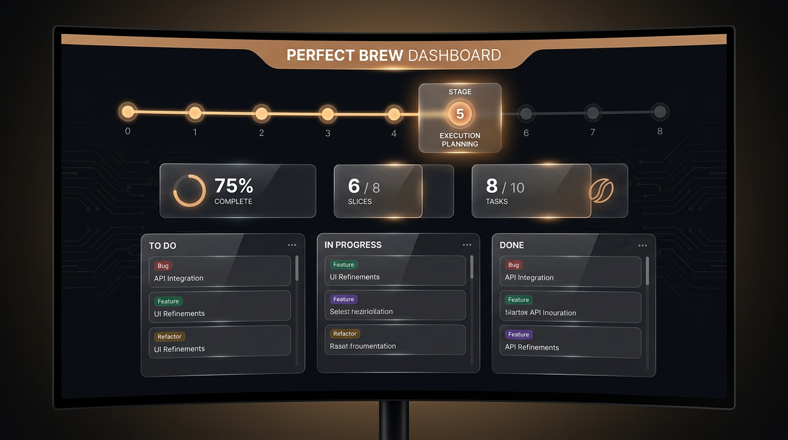
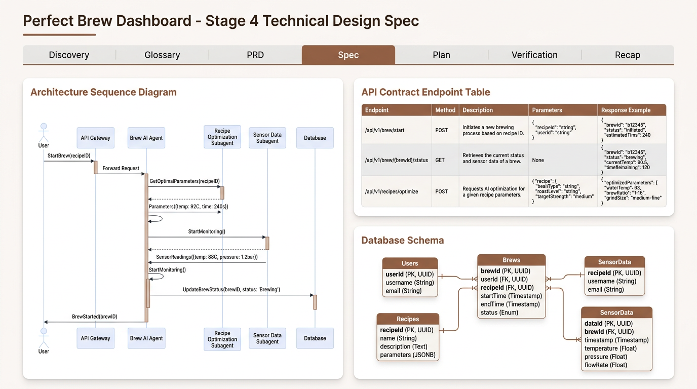

<!--
Copyright 2026 Google LLC

Licensed under the Apache License, Version 2.0 (the "License");
you may not use this file except in compliance with the License.
You may obtain a copy of the License at

    https://www.apache.org/licenses/LICENSE-2.0

Unless required by applicable law or agreed to in writing, software
distributed under the License is distributed on an "AS IS" BASIS,
WITHOUT WARRANTIES OR CONDITIONS OF ANY KIND, either express or implied.
See the License for the specific language governing permissions and
limitations under the License.
-->

# 📊 Unified Master Visual Dashboard (`visual-dashboard.html`)

The **Unified Master Visual Dashboard** (`visual-dashboard.html`) is a core innovation of the **Bean-to-Cup** autonomous barista swarm. It translates Markdown-based SDLC artifacts (`00_IDEATION.md`, `02_PRD.md`, `04_SPEC.md`, `05_PLAN.md`, etc.) into a **live, rich, interactive web application** that updates deterministically across every stage of the development process.

---

## 📸 Visual Dashboard in Action

### 1. Brew Overview & Interactive Kanban (Stages 5 & 7)
The **Overview Tab** displays real-time sprint metrics, active stage badges, a pulse-animated timeline stepper, and a drag-and-drop interactive Kanban board tracking task completion.



### 2. Technical Design Spec Tab (Stage 4)
The **Design Spec Tab** renders architecture sequence diagrams (Mermaid.js), OpenAPI endpoint tables, database schemas, and lo-fi wireframe cards directly from `04_SPEC.md`.



---

## 🌟 Key Features & Philosophy

1. **"Create-if-Missing, Preserve & Update" Protocol**:
   A feature task can enter the pipeline at any stage (e.g., Stage 0 Discovery, Stage 2 PRD, or Stage 4 Technical Design). The manager script checks if `visual-dashboard.html` exists in the plan directory (`plans/<feature-slug>/<timestamp>/`). If missing, it instantiates it from template. If present, it updates **only** the active stage tab while preserving all previous stage tabs intact.

2. **Dual-Write Guarantee & Live Chat UI Mirroring**:
   Every time the dashboard is updated, `manage_dashboard.py` automatically mirrors the dashboard directly to the assistant's active conversation brain artifacts directory (`~/.gemini/antigravity-cli/brain/<conversation-id>/00_visual-dashboard.html`). This allows developers to monitor live feature progress in the side-panel Artifact viewer without leaving the chat interface.

3. **Zero External Runtime Dependencies**:
   The entire dashboard lifecycle script (`manage_dashboard.py`) is written in standard Python 3 (`argparse`, `re`, `html`, `shutil`, `subprocess`). It requires no `npm` installs, node build steps, or headless browser rendering.

4. **100% Full-Fidelity Markdown Parity**:
   Rather than truncating text, `manage_dashboard.py` converts raw markdown elements (headers, lists, callout boxes, responsive HTML tables, fenced code blocks, and Mermaid diagrams) into clean HTML card structures, maintaining 100% content parity with workspace `.md` files.

---

## 🏗️ Architecture & Component Layout

The visual dashboard system is modularly packaged in `skills/visual-dashboard/`:

```
skills/visual-dashboard/
├── SKILL.md                          (Antigravity Skill Specification)
├── scripts/
│   └── manage_dashboard.py          (Deterministic CLI Manager Script)
└── resources/
    └── visual-dashboard.html        (Unified Master HTML Template)
```

### File Responsibilities

*   **[`resources/visual-dashboard.html`](../skills/visual-dashboard/resources/visual-dashboard.html)**:
    A standalone, zero-dependency HTML file containing CSS design tokens for light/dark mode, sticky vertical sidebar navigation on the left hand side, an animated timeline stepper, responsive card grids, and predefined comment markers for each stage.
*   **[`scripts/manage_dashboard.py`](../skills/visual-dashboard/scripts/manage_dashboard.py)**:
    The central Python authority that parses markdown artifacts, calculates progress metrics, updates comment blocks in `visual-dashboard.html`, and mirrors files to the AGY brain directory.
*   **[`SKILL.md`](../skills/visual-dashboard/SKILL.md)**:
    The skill definition conforming to the Google Antigravity Skills specification.

---

## 🔄 SDLC Stage & Comment Marker Mapping

Each SDLC stage maps to dedicated comment block markers inside `visual-dashboard.html`:

| SDLC Stage | Stage Name | Target Tab | Section Comment Markers | CLI Sync Subcommand |
| :--- | :--- | :--- | :--- | :--- |
| **Stage 0** | Product Discovery | Discovery | `<!-- VD:RAW_IDEATION -->`<br>`<!-- VD:OVERVIEW -->` | `sync-ideation` |
| **Stage 1** | Glossary & ADRs | Glossary | `<!-- VG:RAW_GLOSSARY -->`<br>`<!-- VG:GLOSSARY -->`<br>`<!-- VG:ADR -->` | `sync-glossary` |
| **Stage 2** | Requirements (PRD) | PRD | `<!-- VPO:RAW_PRD -->`<br>`<!-- VPO:OVERVIEW -->` | `sync-prd` |
| **Stage 3** | Context Extraction | Extraction | `<!-- VX:RAW_EXTRACTION -->`<br>`<!-- VX:OVERVIEW -->` | `sync-extraction` |
| **Stage 4** | Technical Spec | Spec | `<!-- VA:RAW_SPEC -->`<br>`<!-- VA:OVERVIEW -->` | `sync-spec` |
| **Stage 5** | Execution Plan | Overview | `<!-- VP:RAW_PLAN -->`<br>`<!-- VP:OVERVIEW -->` | `sync-plan` |
| **Stage 7** | TDD Implementation | Overview / Kanban | `<!-- VV:RAW_VERIFICATION -->`<br>`<!-- VV:OVERVIEW -->` | `sync-verification` |
| **Stage 8** | Walkthrough Recap | Recap | `<!-- VIR:RAW_RECAP -->`<br>`<!-- VIR:OVERVIEW -->` | `sync-recap` |

---

## 🛠️ CLI Usage & Integration

Skills and developers interact with `manage_dashboard.py` via subcommand flags:

### 1. Auto-Sync Entire Plan Directory
Automatically scans `plans/<feature-slug>/<timestamp>/` for all stage markdown files, parses present artifacts, updates stage tracker badges, computes progress metrics, and mirrors to system artifacts:

```bash
python3 skills/visual-dashboard/scripts/manage_dashboard.py auto-sync \
  --plan-dir "plans/feature-name/20260806" \
  --moniker "feature-name"
```

### 2. Stage-Specific Synchronization
Update a single stage tab after writing or updating a markdown artifact:

```bash
# Sync Product Requirements Document (PRD)
python3 skills/visual-dashboard/scripts/manage_dashboard.py sync-prd \
  --plan-dir "plans/feature-name/20260806"

# Sync Glossary terms and ADRs
python3 skills/visual-dashboard/scripts/manage_dashboard.py sync-glossary \
  --plan-dir "plans/feature-name/20260806" \
  --stage "Stage 1"
```

### 3. Direct Section Update
Insert custom HTML or raw strings directly between specific comment markers:

```bash
python3 skills/visual-dashboard/scripts/manage_dashboard.py update \
  --plan-dir "plans/feature-name/20260806" \
  --section "VP:OVERVIEW" \
  --content "<div class='card'>Custom Card Content</div>"
```

### 4. Mirror to System Brain Directory
Force a dual-write copy to the chat UI artifact directory:

```bash
python3 skills/visual-dashboard/scripts/manage_dashboard.py mirror \
  --plan-dir "plans/feature-name/20260806" \
  --target-filename "00_visual-dashboard.html"
```

---

## 🧪 Testing & Verification

The visual dashboard system is backed by comprehensive unit and E2E simulation tests in `tests/`:

*   **`test_manage_dashboard.py`**:
    Verifies `ensure_dashboard`, section marker replacement, badge updates, metric calculations, and brain artifact mirroring.
*   **`test_sdlc_headless_e2e.py`**:
    Simulates a full SDLC run across Stages 0 to 8, invoking all stage skills and verifying 100% content parity in `visual-dashboard.html`.

Run the test suite locally:

```bash
python3 -m unittest tests/test_manage_dashboard.py
```
