# ☕ Bean-to-Cup: SDLC Workflow & Component Validation

This document is the definitive validation reference. It maps every remaining active **Command**, **Skill**, and **Subagent** in the workspace, explaining exactly **who** calls it, **when** it is triggered, and **how** it connects to the end-to-end 9-stage software development lifecycle (SDLC).

---

## 🗺️ The Active Component Map

```mermaid
flowchart TD
    %% Style Classes Definition
    classDef default fill:#f9f9f9,stroke:#333,stroke-width:2px,color:#333;
    classDef stage fill:#ffffff,stroke:#4285F4,stroke-width:2.5px,color:#333,font-weight:bold;
    classDef user fill:#eef2ff,stroke:#6366f1,stroke-width:2px,color:#312e81,font-weight:bold;
    classDef component fill:#f0fdf4,stroke:#16a34a,stroke-width:2px,color:#14532d;
    classDef artifact fill:#fffbeb,stroke:#d97706,stroke-width:2px,color:#78350f,font-style:italic;
    classDef gate fill:#fef2f2,stroke:#dc2626,stroke-width:2.5px,color:#991b1b,font-weight:bold;

    %% STAGE 0: PRODUCT DISCOVERY
    subgraph S0 ["Stage 0: Product Discovery (Optional)"]
        S0_Title["Stage 0: Discovery"]:::stage
        U0["User Types:<br>Brainstorm / request"]:::user
        I0["Input:<br>Initial Prompt"]:::default
        C0["Skill: ideator"]:::component
        A0["Output:<br>00_IDEATION.md"]:::artifact
        
        U0 --> C0
        I0 --> C0
        C0 --> A0
    end

    %% STAGE 1: SOCRATIC ALIGNMENT
    subgraph S1 ["Stage 1: Socratic Alignment"]
        S1_Title["Stage 1: Socratic Alignment"]:::stage
        U1["User Types:<br><b>/feature [goal]</b><br>+ Answers Socratic Qs"]:::user
        I1["Input:<br>00_IDEATION.md (Optional)"]:::artifact
        C1["Skills: grill, grilling,<br>domain-modeling"]:::component
        A1["Output:<br>01_GLOSSARY.md<br>(Glossary + ADRs)"]:::artifact
        
        A0 -.-> I1
        U1 --> C1
        I1 --> C1
        C1 --> A1
    end

    %% STAGE 2: PRODUCT REQUIREMENTS
    subgraph S2 ["Stage 2: Product Requirements"]
        S2_Title["Stage 2: Product Requirements"]:::stage
        U2["User Action:<br>Reviews PRD in chat UI"]:::user
        I2["Input:<br>01_GLOSSARY.md"]:::artifact
        C2["Skill: write-prd"]:::component
        A2["Output:<br>02_PRD.md<br>(Non-goals & KPIs)"]:::artifact
        
        A1 --> I2
        U2 -.-> C2
        I2 --> C2
        C2 --> A2
    end

    %% STAGE 3: CONTEXT EXTRACTION
    subgraph S3 ["Stage 3: Context Extraction"]
        S3_Title["Stage 3: Context Extraction"]:::stage
        U3["User Action:<br>Approves PRD<br>(or types <b>/research [query]</b>)"]:::user
        I3["Input:<br>02_PRD.md / query"]:::artifact
        C3["Command: <b>/research</b><br>➔ Skill: research<br>➔ Subagents: @scout,<br>@context-mapping,<br>@codebase-analyzer,<br>@pattern-recognition"]:::component
        A3["Output:<br>03_EXTRACTION.md<br>(Factual Code Map)"]:::artifact
        
        A2 --> I3
        U3 --> C3
        I3 --> C3
        C3 --> A3
    end

    %% STAGE 4 & 5: TECH SPEC & EXECUTION PLAN
    subgraph S45 ["Stages 4 & 5: Spec & Plan"]
        S45_Title["Stages 4 & 5: Spec & Plan"]:::stage
        U45["User Action:<br>None (Automated)"]:::user
        I45_1["Input 1:<br>02_PRD.md"]:::artifact
        I45_2["Input 2:<br>03_EXTRACTION.md"]:::artifact
        C45["Subagent: @architect<br>(system-design.md)"]:::component
        A4["Output:<br>04_SPEC.md (Contracts)"]:::artifact
        A5["Output:<br>05_PLAN.md (Checklist)"]:::artifact
        
        A2 -.-> I45_1
        A3 --> I45_2
        I45_1 --> C45
        I45_2 --> C45
        C45 --> A4
        C45 --> A5
    end

    %% STAGE 6: HUMAN GATE
    subgraph S6 ["Stage 6: Human Review Gate"]
        S6_Title["Stage 6: Human Gate"]:::gate
        U6["User Action:<br>Reviews 04_SPEC contracts<br>and types <b>'approve'</b>"]:::user
        I6_1["Input 1:<br>04_SPEC.md"]:::artifact
        I6_2["Input 2:<br>05_PLAN.md"]:::artifact
        
        A4 --> I6_1
        A5 --> I6_2
        I6_1 --> U6
        I6_2 --> U6
    end

    %% STAGE 7: TEST-DRIVEN IMPLEMENTATION
    subgraph S7 ["Stage 7: Test-Driven Implementation (TDD)"]
        S7_Title["Stage 7: TDD Loop"]:::stage
        U7["User Action:<br>Approves milestone commits<br>(Types 'yes' / 'approve')"]:::user
        I7_1["Input 1:<br>04_SPEC.md (Contracts)"]:::artifact
        I7_2["Input 2:<br>05_PLAN.md (Checklist)"]:::artifact
        C7["Subagents: @engineer, @auditor,<br>@code-review<br>➔ Skills: generate-code, audit-code,<br>kanban, deploy-app<br>➔ Hook: lint-on-change.sh"]:::component
        A7["Outputs:<br>- Working verified code<br>- 07_VERIFICATION.md (Logs)"]:::artifact
        
        U6 -->|Approved| C7
        A4 -.-> I7_1
        A5 -.-> I7_2
        I7_1 --> C7
        I7_2 --> C7
        U7 -.-> C7
        C7 --> A7
    end

    %% STAGE 8: AUTOMATED WALKTHROUGH
    subgraph S8 ["Stage 8: Automated Walkthrough"]
        S8_Title["Stage 8: Walkthrough"]:::stage
        U8["User Types:<br><b>/brew:record</b>"]:::user
        I8_1["Input 1:<br>07_VERIFICATION.md"]:::artifact
        I8_2["Input 2:<br>walkthrough_scenario.json"]:::default
        C8["Command: <b>/brew:record</b><br>➔ Skill: asciinema"]:::component
        A8["Output:<br>08_WALKTHROUGH.md<br>(Terminal playbacks / GIF)"]:::artifact
        
        A7 --> I8_1
        U8 --> C8
        I8_1 --> C8
        I8_2 --> C8
        C8 --> A8
    end

    %% STAGE 9: PR DELIVERY & MAINTENANCE
    subgraph S9 ["Stage 9: PR Delivery & Maintenance"]
        S9_Title["Stage 9: Delivery & PR"]:::stage
        U9["User Action:<br>Completes PR review<br>Optionally types:<br><b>/brew:archive</b>, <b>/brew:sync</b>,<br><b>/brew:worktree</b>, <b>/build:production</b>"]:::user
        I9_1["Input 1:<br>Working code"]:::artifact
        I9_2["Input 2:<br>08_WALKTHROUGH.md"]:::artifact
        C9["Skill: github-workflow<br>(creates PR via <b>gh</b> CLI)"]:::component
        A9["Output:<br>Active GitHub PR<br>& clean workspace"]:::artifact
        
        A8 --> I9_2
        U9 --> C9
        I9_1 --> C9
        I9_2 --> C9
        C9 --> A9
    end
```

---

## ⚡ Step-by-Step E2E Stage Validation

### ☕ STAGE 0: PRODUCT DISCOVERY / IDEATION (Optional)
*   **Purpose:** Transforms a raw, unstructured user feature request or idea into a structured product discovery brief.
*   **Who Calls It:** The **USER** triggers this optionally by typing `/feature <idea>` or requesting a brainstorm.
*   **Active Components Engaged:**
    *   **Command:** [`/feature`](file:///home/robedwards/workspace/bean-to-cup/commands/feature.toml) initializes the state machine.
    *   **Skills:**
        *   [`feature`](file:///home/robedwards/workspace/bean-to-cup/skills/feature/SKILL.md): Creates the feature slug and timestamps, bootstraps the versioned plans subdirectory (`plans/<feature-slug>/<timestamp>/`), and hands off execution.
        *   [`ideator`](file:///home/robedwards/workspace/bean-to-cup/skills/ideator/SKILL.md): Analyzes friction points, creates persona-based flows, and outputs the ideation brief.
*   **Produced Artifact:** `plans/<feature-slug>/<timestamp>/00_IDEATION.md`.

---

### ☕ STAGE 1: SOCRATIC ALIGNMENT (The Grill)
*   **Purpose:** Stress-tests edge cases, clarifies ambiguities, and constructs a robust Ubiquitous Glossary.
*   **Who Calls It:** The **Orchestration Engine (Head Barista)** triggers this at the start of feature definition.
*   **Active Components Engaged:**
    *   **Skills:**
        *   [`grill`](file:///home/robedwards/workspace/bean-to-cup/skills/grill/SKILL.md): Coordinates the overall alignment interview flow.
        *   [`grilling`](file:///home/robedwards/workspace/bean-to-cup/skills/grilling/SKILL.md): Conducts the relentless interview loop with the developer.
        *   [`domain-modeling`](file:///home/robedwards/workspace/bean-to-cup/skills/domain-modeling/SKILL.md): Compiles and edits definitions *on-the-fly* directly inside the plans folder and updates the project-wide glossary.
*   **Produced Artifact:** `plans/<feature-slug>/<timestamp>/01_GLOSSARY.md`.

---

### ☕ STAGE 2: PRODUCT REQUIREMENTS (PRD)
*   **Purpose:** Captures technology-agnostic business logic, non-goals, KPIs, and clear user story acceptance criteria.
*   **Who Calls It:** The **Orchestration Engine (Head Barista)** triggers this once Socratic Alignment is complete.
*   **Active Components Engaged:**
    *   **Skill:** [`write-prd`](file:///home/robedwards/workspace/bean-to-cup/skills/write-prd/SKILL.md): Synthesizes the glossary and Socratic discussion into a formal requirements document.
*   **Produced Artifact:** `plans/<feature-slug>/<timestamp>/02_PRD.md`.
*   **Exit Criteria:** The USER reviews the PRD inside the chat UI and confirms it is accurate.

---

### ☕ STAGE 3: CONTEXT EXTRACTION (Research)
*   **Purpose:** Gathers a precise, factual mapping of the existing codebase with a strict **Context Firewall** to protect context window limits and avoid design bias.
*   **Who Calls It:** The **Orchestration Engine (Head Barista)** triggers this after the PRD is approved.
*   **Active Components Engaged:**
    *   **Command:** [`/research`](file:///home/robedwards/workspace/bean-to-cup/commands/research.toml).
    *   **Skill:** [`research`](file:///home/robedwards/workspace/bean-to-cup/skills/research/SKILL.md): Orchestrates context-isolated codebase scans.
    *   **Subagents Dispatched (Parallel Tasking):**
        *   `@scout` ([`context-discovery.md`](file:///home/robedwards/workspace/bean-to-cup/agents/context-discovery.md)): Maps codebase symbols and import hierarchies.
        *   `@context-mapping` ([`context-mapping.md`](file:///home/robedwards/workspace/bean-to-cup/agents/context-mapping.md)): Locates entry points, folders, and controllers.
        *   `@codebase-analyzer` ([`codebase-analysis.md`](file:///home/robedwards/workspace/bean-to-cup/agents/codebase-analysis.md)): Investigates specific implementation files.
        *   `@pattern-recognition` ([`pattern-recognition.md`](file:///home/robedwards/workspace/bean-to-cup/agents/pattern-recognition.md)): Identifies existing code conventions to maintain consistency.
*   **Produced Artifact:** `plans/<feature-slug>/<timestamp>/03_EXTRACTION.md` (no suggestions/critiques; pure facts).

---

### ☕ STAGE 4: TECHNICAL SPECIFICATION (Spec)
*   **Purpose:** Designs physical software architecture, data models, threat models, and SRE custom telemetry.
*   **Who Calls It:** The **Orchestration Engine (Head Barista)** triggers this once context mapping and PRD are ready.
*   **Active Components Engaged:**
    *   **Subagent:** `@architect` ([`system-design.md`](file:///home/robedwards/workspace/bean-to-cup/agents/system-design.md)): Receives requirements and existing codebase facts to craft the conceptual spec.
*   **Produced Artifact:** `plans/<feature-slug>/<timestamp>/04_SPEC.md`.

---

### ☕ STAGE 5: EXECUTION PLANNING (Plan)
*   **Purpose:** Breaks the spec down into tiny, vertical "tracer bullet" slices, designs contracts/interfaces, and prioritizes TDD checklist tasks.
*   **Who Calls It:** The **Orchestration Engine (Head Barista)** triggers this right after drafting the spec.
*   **Active Components Engaged:**
    *   **Subagent:** `@architect` ([`system-design.md`](file:///home/robedwards/workspace/bean-to-cup/agents/system-design.md)): Sequences physical contracts, mock APIs, and functional checklist items.
*   **Produced Artifact:** `plans/<feature-slug>/<timestamp>/05_PLAN.md` (checklist format).

---

### ☕ STAGE 6: HUMAN REVIEW GATE (🛑 STOP)
*   **Purpose:** Human alignment on high-leverage API schemas, DB contracts, and design trade-offs before any functional logic is written.
*   **Who Calls It:** The **Orchestration Engine (Head Barista)** halts automatically.
*   **Action:** Displays the ~200-line architecture summary and contracts from `plans/04_SPEC.md` to the user.
*   **Exit Criteria:** The USER explicitly reviews and types `"approve"`.

---

### ☕ STAGE 7: TEST-DRIVEN IMPLEMENTATION (TDD Loop)
*   **Purpose:** Writes contracts and failing tests first, develops the minimal functional code to green them, and enforces rigid linting back-pressure.
*   **Who Calls It:** The **Orchestration Engine (Head Barista)** triggers this upon receiving `"approve"`.
*   **Active Components Engaged:**
    *   **Subagents Dispatched:**
        *   `@engineer` ([`code-implementation.md`](file:///home/robedwards/workspace/bean-to-cup/agents/code-implementation.md)): Translates specifications into clean, working code in a strict failing-to-passing TDD cycle.
        *   `@auditor` ([`quality-verification.md`](file:///home/robedwards/workspace/bean-to-cup/agents/quality-verification.md)): Executes local test suites, linters, and type-checkers.
        *   `@code-review` ([`code-inspection.md`](file:///home/robedwards/workspace/bean-to-cup/agents/code-inspection.md)): Audits implementation diffs line-by-line for complexity and code smells.
    *   **Skills:**
        *   [`generate-code`](file:///home/robedwards/workspace/bean-to-cup/skills/generate-code/SKILL.md): Bootstraps files, mocks, and boilerplate structures.
        *   [`audit-code`](file:///home/robedwards/workspace/bean-to-cup/skills/audit-code/SKILL.md): Diagnoses and commits test/compile fixes to the codebase.
        *   [`kanban`](file:///home/robedwards/workspace/bean-to-cup/skills/kanban/SKILL.md): Synthesizes Markdown and Mermaid Gantt charts to keep task progress visual.
        *   [`deploy-app`](file:///home/robedwards/workspace/bean-to-cup/skills/deploy-app/SKILL.md): Installs local dependencies and runs localized feature servers.
        *   [`chaos-mitigation`](file:///home/robedwards/workspace/bean-to-cup/skills/chaos-mitigation/SKILL.md): Only used if resolving simulation outages/telemetry alerts.
    *   **Automated Hooks (Post Tool Use):**
        *   [`lint-on-change`](file:///home/robedwards/workspace/bean-to-cup/hooks/lint-on-change.sh): Automatically triggered on file edits to apply immediate linter feedback.
*   **Produced Artifact:** `plans/<feature-slug>/<timestamp>/07_VERIFICATION.md` (successful test logs).

---

### ☕ STAGE 8: AUTOMATED WALKTHROUGH
*   **Purpose:** Captures terminal recordings and visual evidence verifying complete functional behavior.
*   **Who Calls It:** The **Orchestration Engine (Head Barista)** once all Stage 7 tasks are green and staged.
*   **Active Components Engaged:**
    *   **Command:** [`/brew:record`](file:///home/robedwards/workspace/bean-to-cup/commands/brew:record.toml) launches recording.
    *   **Skill:** [`asciinema`](file:///home/robedwards/workspace/bean-to-cup/skills/asciinema/SKILL.md): Automatically compiles animated playback `.gif` assets of the terminal commands.
*   **Produced Artifact:** `plans/<feature-slug>/<timestamp>/08_WALKTHROUGH.md` (fully visual Technical proof).

---

### ☕ STAGE 9: PR DELIVERY & MAINTENANCE
*   **Purpose:** Pushes git branches, creates pull requests, and archives completed task context.
*   **Who Calls It:** The **Orchestration Engine (Head Barista)**.
*   **Active Components Engaged:**
    *   **Skill:** [`github-workflow`](file:///home/robedwards/workspace/bean-to-cup/skills/github-workflow/SKILL.md): Manages staging, conventions, and uses `gh` to open the PR.
    *   **Commands:**
        *   [`/brew:archive`](file:///home/robedwards/workspace/bean-to-cup/commands/brew:archive.toml): Clears spent feature grounds to save context limits.
        *   [`/brew:sync`](file:///home/robedwards/workspace/bean-to-cup/commands/brew:sync.toml): Pulls branch upstream states.
        *   [`/brew:worktree`](file:///home/robedwards/workspace/bean-to-cup/commands/brew:worktree.toml): Manages clean isolation of branches.
        *   [`/build:production`](file:///home/robedwards/workspace/bean-to-cup/commands/build:production.toml): Generates release-ready binary compilations.

---

## 🛠️ Utility & Assistant Helper Commands

*   [`/dev`](file:///home/robedwards/workspace/bean-to-cup/commands/dev.toml): For minor, simple inline requests outside the 9-stage pipeline.
*   [`/test:api`](file:///home/robedwards/workspace/bean-to-cup/commands/test:api.toml): Fast, suite-level endpoints regression check.
