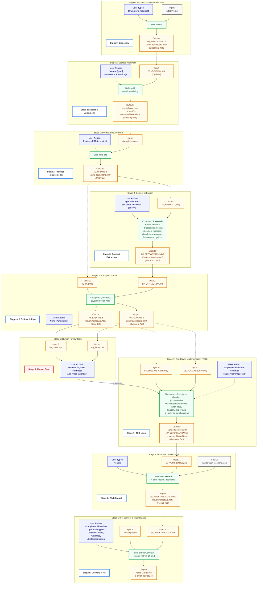

# ☕ Bean-to-Cup: SDLC Workflow & Component Validation

This document is the definitive validation reference. It maps every active **Command**, **Skill**, and **Subagent** in the workspace, explaining exactly **who** calls it, **when** it is triggered, **inputs**, **outputs**, **data pulled in**, and **how** it connects to the end-to-end 9-stage software development lifecycle (SDLC).

---

## 🗺️ The Active Component Map


```mermaid
flowchart TD
    %% Style Classes Definition
    classDef default fill:#f9f9f9,stroke:#333,stroke-width:2px,color:#333;
    classDef stage fill:#ffffff,stroke:#4285F4,stroke-width:2.5px,color:#333,font-weight:bold;
    classDef user fill:#eef2ff,stroke:#6366f1,stroke-width:2px,color:#312e81,font-weight:bold;
    classDef component fill:#f0fdf4,stroke:#16a34a,stroke-width:2px,color:#14532d;
    classDef artifact fill:#fffbeb,stroke:#d97706,stroke-width:2px,color:#78350f,font-style:italic;
    classDef gate fill:#fef2f2,stroke:#dc2626,stroke-width:2.5px,color:#991b1b,font-weight:bold;

    %% STAGE 0: PRODUCT DISCOVERY
    subgraph S0 ["Stage 0: Product Discovery (Optional)"]
        S0_Title["Stage 0: Discovery"]:::stage
        U0["User Types:<br>Brainstorm / request"]:::user
        I0["Input:<br>Initial Prompt"]:::default
        C0["Skill: ideator"]:::component
        A0["Outputs:<br>00_IDEATION.md &<br>visual-dashboard.html (Discovery Tab)"]:::artifact
        
        U0 --> C0
        I0 --> C0
        C0 --> A0
    end

    %% STAGE 1: SOCRATIC ALIGNMENT
    subgraph S1 ["Stage 1: Socratic Alignment"]
        S1_Title["Stage 1: Socratic Alignment"]:::stage
        U1["User Types:<br><b>/feature [goal]</b><br>+ Answers Socratic Qs"]:::user
        I1["Input:<br>00_IDEATION.md (Optional)"]:::artifact
        C1["Skills: grill,<br>domain-modeling"]:::component
        A1["Outputs:<br>docs/glossary.md,<br>docs/adr/ &<br>visual-dashboard.html (Glossary Tab)"]:::artifact
        
        A0 -.-> I1
        U1 --> C1
        I1 --> C1
        C1 --> A1
    end

    %% STAGE 2: PRODUCT REQUIREMENTS
    subgraph S2 ["Stage 2: Product Requirements"]
        S2_Title["Stage 2: Product Requirements"]:::stage
        U2["User Action:<br>Reviews PRD in chat UI"]:::user
        I2["Input:<br>docs/glossary.md"]:::artifact
        C2["Skill: write-prd"]:::component
        A2["Outputs:<br>02_PRD.md &<br>visual-dashboard.html (PRD Tab)"]:::artifact
        
        A1 --> I2
        U2 -.-> C2
        I2 --> C2
        C2 --> A2
    end

    %% STAGE 3: CONTEXT EXTRACTION
    subgraph S3 ["Stage 3: Context Extraction"]
        S3_Title["Stage 3: Context Extraction"]:::stage
        U3["User Action:<br>Approves PRD<br>(or types <b>/research [query]</b>)"]:::user
        I3["Input:<br>02_PRD.md / query"]:::artifact
        C3["Command: <b>/research</b><br>➔ Skill: research<br>➔ Subagents: @scout,<br>@context-mapping,<br>@codebase-analyzer,<br>@pattern-recognition"]:::component
        A3["Outputs:<br>03_EXTRACTION.md &<br>visual-dashboard.html (Extraction Tab)"]:::artifact
        
        A2 --> I3
        U3 --> C3
        I3 --> C3
        C3 --> A3
    end

    %% STAGE 4 & 5: TECH SPEC & EXECUTION PLAN
    subgraph S45 ["Stages 4 & 5: Spec & Plan"]
        S45_Title["Stages 4 & 5: Spec & Plan"]:::stage
        U45["User Action:<br>None (Automated)"]:::user
        I45_1["Input 1:<br>02_PRD.md"]:::artifact
        I45_2["Input 2:<br>03_EXTRACTION.md"]:::artifact
        C45["Subagent: @architect<br>(system-design.md)"]:::component
        A4["Output:<br>04_SPEC.md &<br>visual-dashboard.html (Spec Tab)"]:::artifact
        A5["Output:<br>05_PLAN.md &<br>visual-dashboard.html (Overview Tab)"]:::artifact
        
        A2 -.-> I45_1
        A3 --> I45_2
        I45_1 --> C45
        I45_2 --> C45
        C45 --> A4
        C45 --> A5
    end

    %% STAGE 6: HUMAN GATE
    subgraph S6 ["Stage 6: Human Review Gate"]
        S6_Title["Stage 6: Human Gate"]:::gate
        U6["User Action:<br>Reviews 04_SPEC contracts<br>and types <b>'approve'</b>"]:::user
        I6_1["Input 1:<br>04_SPEC.md"]:::artifact
        I6_2["Input 2:<br>05_PLAN.md"]:::artifact
        
        A4 --> I6_1
        A5 --> I6_2
        I6_1 --> U6
        I6_2 --> U6
    end

    %% STAGE 7: TEST-DRIVEN IMPLEMENTATION
    subgraph S7 ["Stage 7: Test-Driven Implementation (TDD)"]
        S7_Title["Stage 7: TDD Loop"]:::stage
        U7["User Action:<br>Approves milestone commits<br>(Types 'yes' / 'approve')"]:::user
        I7_1["Input 1:<br>04_SPEC.md (Contracts)"]:::artifact
        I7_2["Input 2:<br>05_PLAN.md (Checklist)"]:::artifact
        C7["Subagents: @engineer, @auditor,<br>@code-review<br>➔ Skills: generate-code, audit-code,<br>kanban, deploy-app<br>➔ Hook: lint-on-change.sh"]:::component
        A7["Outputs:<br>- Verified source code<br>- 07_VERIFICATION.md<br>- visual-dashboard.html (Overview Tab)"]:::artifact
        
        U6 -->|Approved| C7
        A4 -.-> I7_1
        A5 -.-> I7_2
        I7_1 --> C7
        I7_2 --> C7
        U7 -.-> C7
        C7 --> A7
    end

    %% STAGE 8: AUTOMATED WALKTHROUGH
    subgraph S8 ["Stage 8: Automated Walkthrough"]
        S8_Title["Stage 8: Walkthrough"]:::stage
        U8["User Types:<br><b>/record</b>"]:::user
        I8_1["Input 1:<br>07_VERIFICATION.md"]:::artifact
        I8_2["Input 2:<br>walkthrough_scenario.json"]:::default
        C8["Command: <b>/record</b><br>➔ Skill: record / asciinema"]:::component
        A8["Outputs:<br>08_WALKTHROUGH.md &<br>visual-dashboard.html (Recap Tab)"]:::artifact
        
        A7 --> I8_1
        U8 --> C8
        I8_1 --> C8
        I8_2 --> C8
        C8 --> A8
    end

    %% STAGE 9: PR DELIVERY & MAINTENANCE
    subgraph S9 ["Stage 9: PR Delivery & Maintenance"]
        S9_Title["Stage 9: Delivery & PR"]:::stage
        U9["User Action:<br>Completes PR review<br>Optionally types:<br><b>/archive</b>, <b>/sync</b>,<br><b>/worktree</b>, <b>/build:production</b>"]:::user
        I9_1["Input 1:<br>Working code"]:::artifact
        I9_2["Input 2:<br>08_WALKTHROUGH.md"]:::artifact
        C9["Skill: github-workflow<br>(creates PR via <b>gh</b> CLI)"]:::component
        A9["Outputs:<br>Active GitHub PR<br>& clean workspace"]:::artifact
        
        A8 --> I9_2
        U9 --> C9
        I9_1 --> C9
        I9_2 --> C9
        C9 --> A9
    end
```

---

## 🔗 Skill Nesting & Subagent Composition Topology

This topology map explicitly details how parent commands and skills nest child skills and dispatch specialized subagents across the SDLC state machine:

```
1. /feature (Command)
   └── feature (Skill)
       ├── Nests: ideator (Skill) [Optional Stage 0 Discovery]
       ├── Nests: grill (Skill) [Stage 1 Socratic Alignment]
       │   ├── Nests: domain-modeling (Skill) [Updates docs/glossary.md & docs/adr/]
       │   └── Nests: visual-dashboard (Skill) [Syncs Glossary Tab]
       └── Nests: write-prd (Skill) [Stage 2 PRD Generation]
           └── Nests: visual-dashboard (Skill) [Syncs PRD Tab]

2. /research (Command)
   └── research (Skill)
       ├── Dispatches Subagent: @scout (context-discovery.md)
       ├── Dispatches Subagent: @context-mapping (context-mapping.md)
       ├── Dispatches Subagent: @codebase-analyzer (codebase-analysis.md)
       ├── Dispatches Subagent: @pattern-recognition (pattern-recognition.md)
       └── Nests: visual-dashboard (Skill) [Syncs Extraction Tab]

3. Stages 4 & 5 (Specification & Execution Planning)
   └── Head Barista Orchestrator
       ├── Dispatches Subagent: @architect (system-design.md)
       ├── Nests: kanban (Skill) [Generates Interactive Kanban]
       └── Nests: visual-dashboard (Skill) [Syncs Spec & Overview Tabs]

4. Stage 7 (Test-Driven Implementation Loop)
   └── Head Barista Orchestrator
       ├── Dispatches Subagent: @engineer (code-implementation.md)
       ├── Dispatches Subagent: @auditor (quality-verification.md)
       ├── Dispatches Subagent: @code-review (code-inspection.md)
       ├── Nests: generate-code (Skill)
       ├── Nests: audit-code (Skill)
       ├── Nests: kanban (Skill)
       ├── Nests: deploy-app (Skill)
       ├── Nests: visual-dashboard (Skill) [Syncs Overview Tab]
       └── Triggers Hook: lint-on-change.sh

5. /rewrite (Command)
   └── rewrite (Skill)
       ├── Nests: assess (Skill) [CodMod CLI & GCP Checks]
       ├── Nests: grill (Skill)
       ├── Nests: write-prd (Skill)
       └── Nests: research (Skill)

6. /record (Command)
   └── record (Skill)
       └── Nests: visual-dashboard (Skill) [Syncs Recap Tab]

7. /push (Command)
   └── github-workflow / git-delivery (Skills) [Creates GitHub PR via gh CLI]
```

---

## ⚡ Step-by-Step E2E Stage Validation

### ☕ STAGE 0: PRODUCT DISCOVERY / IDEATION (Optional)
*   **What It Does:** Transforms a raw, unstructured user feature request or prompt into a structured product discovery draft with persona friction points, customer user journeys (CUJs), ADK routing topologies, and mock data schemas.
*   **Trigger / Orchestration:** User types prompt or `/feature <idea>`, triggering skill [`ideator`](file:///home/robedwards/workspace/bean-to-cup/skills/ideator/SKILL.md).
*   **Inputs Required:** Raw user prompt, initial feature description.
*   **Outputs Produced:** `plans/<slug>/<timestamp>/00_IDEATION.md`, `visual-dashboard.html` (Discovery Tab).
*   **Data Pulled In:** Target persona profiles, problem statements, domain concepts.

---

### ☕ STAGE 1: SOCRATIC ALIGNMENT (The Grill)
*   **What It Does:** Engages the user in a Socratic interview to challenge assumptions, resolve fuzzy domain terms, establish architectural decisions, and build the global Ubiquitous Glossary.
*   **Trigger / Orchestration:** Head Barista orchestrator invokes skill [`grill`](file:///home/robedwards/workspace/bean-to-cup/skills/grill/SKILL.md) and skill [`domain-modeling`](file:///home/robedwards/workspace/bean-to-cup/skills/domain-modeling/SKILL.md).
*   **Inputs Required:** `00_IDEATION.md` (if available), initial user prompt.
*   **Outputs Produced:** `docs/glossary.md`, `docs/adr/00XX-*.md`, `visual-dashboard.html` (Glossary & ADR Tabs).
*   **Data Pulled In:** Codebase domain terminology, Google Cloud Well-Architected Framework guidelines, operational SRE criteria.
*   **Note on Deprecation:** The legacy `grilling` skill is deprecated in favor of `grill`.

---

### ☕ STAGE 2: PRODUCT REQUIREMENTS (PRD)
*   **What It Does:** Captures technology-agnostic product requirements, non-goals, measurable KPIs, target personas, and user story acceptance criteria in Gherkin format.
*   **Trigger / Orchestration:** Head Barista invokes skill [`write-prd`](file:///home/robedwards/workspace/bean-to-cup/skills/write-prd/SKILL.md).
*   **Inputs Required:** `docs/glossary.md`, Stage 1 interview alignment notes.
*   **Outputs Produced:** `plans/<slug>/<timestamp>/02_PRD.md`, `visual-dashboard.html` (PRD Tab).
*   **Data Pulled In:** Business constraints, glossary terms, persona friction points.
*   **Human Gate:** User reviews `02_PRD.md` in chat UI and approves before proceeding.

---

### ☕ STAGE 3: CONTEXT EXTRACTION (Research)
*   **What It Does:** Conducts blind, factual codebase research using specialized parallel subagents to map entry points, components, import hierarchies, and architectural patterns without bias or opinion.
*   **Trigger / Orchestration:** Command `/research` or Head Barista invokes skill [`research`](file:///home/robedwards/workspace/bean-to-cup/skills/research/SKILL.md).
*   **Subagents Dispatched:**
    *   `@scout` ([`context-discovery.md`](file:///home/robedwards/workspace/bean-to-cup/agents/context-discovery.md)): Symbol mapping and file trees.
    *   `@context-mapping` ([`context-mapping.md`](file:///home/robedwards/workspace/bean-to-cup/agents/context-mapping.md)): Entrypoint and boundary mapping.
    *   `@codebase-analyzer` ([`codebase-analysis.md`](file:///home/robedwards/workspace/bean-to-cup/agents/codebase-analysis.md)): Surgical line-by-line component tracing.
    *   `@pattern-recognition` ([`pattern-recognition.md`](file:///home/robedwards/workspace/bean-to-cup/agents/pattern-recognition.md)): Architectural pattern library matching.
*   **Inputs Required:** `02_PRD.md` requirements or research query.
*   **Outputs Produced:** `plans/<slug>/<timestamp>/03_EXTRACTION.md`, `visual-dashboard.html` (Extraction Tab).
*   **Data Pulled In:** Codebase source files, AST symbol maps, import graphs, grep search results.

---

### ☕ STAGE 4: TECHNICAL SPECIFICATION (Spec)
*   **What It Does:** Designs physical software architecture, data schemas, API contracts, threat models, and SRE custom telemetry.
*   **Trigger / Orchestration:** Head Barista dispatches subagent `@architect` ([`system-design.md`](file:///home/robedwards/workspace/bean-to-cup/agents/system-design.md)).
*   **Inputs Required:** `02_PRD.md`, `03_EXTRACTION.md`, existing `design.md` in root.
*   **Outputs Produced:** `plans/<slug>/<timestamp>/04_SPEC.md`, `visual-dashboard.html` (Spec Tab).
*   **Data Pulled In:** Design guidelines, existing API signatures, database schemas, security policies.

---

### ☕ STAGE 5: EXECUTION PLANNING (Plan)
*   **What It Does:** Cuts vertical "tracer bullet" slices, designs physical contracts/interfaces, and formats a sequential TDD checklist with an interactive Kanban board.
*   **Trigger / Orchestration:** Head Barista dispatches subagent `@architect` ([`system-design.md`](file:///home/robedwards/workspace/bean-to-cup/agents/system-design.md)) and skill [`kanban`](file:///home/robedwards/workspace/bean-to-cup/skills/kanban/SKILL.md).
*   **Inputs Required:** `04_SPEC.md`, `02_PRD.md`.
*   **Outputs Produced:** `plans/<slug>/<timestamp>/05_PLAN.md`, `visual-dashboard.html` (Overview Tab Kanban board).
*   **Data Pulled In:** Task dependency trees, physical API contracts.

---

### ☕ STAGE 6: HUMAN REVIEW GATE (🛑 STOP)
*   **What It Does:** Halts execution to present physical contracts, API schemas, and execution slices to the user for explicit approval before writing code.
*   **Trigger / Orchestration:** Automated protocol halt.
*   **Inputs Required:** `04_SPEC.md`, `05_PLAN.md`, `visual-dashboard.html`.
*   **Outputs Produced:** Human approval record.
*   **Exit Criteria:** User explicitly reviews and types `"approve"`.

---

### ☕ STAGE 7: TEST-DRIVEN IMPLEMENTATION (TDD Loop)
*   **What It Does:** Incrementally executes vertical slices using specialized subagents, writing failing tests first, developing minimal code to green them, enforcing linting back-pressure, and updating the interactive Kanban board.
*   **Trigger / Orchestration:** User approval triggers Head Barista to dispatch subagents and skills.
*   **Subagents Dispatched:**
    *   `@engineer` ([`code-implementation.md`](file:///home/robedwards/workspace/bean-to-cup/agents/code-implementation.md)): TDD code builder.
    *   `@auditor` ([`quality-verification.md`](file:///home/robedwards/workspace/bean-to-cup/agents/quality-verification.md)): Test execution & QA verification.
    *   `@code-review` ([`code-inspection.md`](file:///home/robedwards/workspace/bean-to-cup/agents/code-inspection.md)): Code quality & smell review.
*   **Skills Engaged:** [`generate-code`](file:///home/robedwards/workspace/bean-to-cup/skills/generate-code/SKILL.md), [`audit-code`](file:///home/robedwards/workspace/bean-to-cup/skills/audit-code/SKILL.md), [`kanban`](file:///home/robedwards/workspace/bean-to-cup/skills/kanban/SKILL.md), [`deploy-app`](file:///home/robedwards/workspace/bean-to-cup/skills/deploy-app/SKILL.md).
*   **Automated Hooks:** `lint-on-change.sh` (post-tool-use linter back-pressure).
*   **Inputs Required:** `04_SPEC.md` contracts, `05_PLAN.md` tasks.
*   **Outputs Produced:** Verified source code, `plans/<slug>/<timestamp>/07_VERIFICATION.md`, `visual-dashboard.html` (Overview Tab progress).
*   **Data Pulled In:** Test outputs, linter errors, compiler feedback, server health check logs.

---

### ☕ STAGE 8: AUTOMATED WALKTHROUGH
*   **What It Does:** Generates visual and technical verification proof using terminal recording (`record` / `asciinema`) or browser agents, creating animated GIFs and walkthrough recaps.
*   **Trigger / Orchestration:** Command `/record` or Head Barista invokes skill [`record`](file:///home/robedwards/workspace/bean-to-cup/skills/record/SKILL.md).
*   **Inputs Required:** `07_VERIFICATION.md`, walkthrough scenario script or terminal execution.
*   **Outputs Produced:** `plans/<slug>/<timestamp>/08_WALKTHROUGH.md`, `.gif` assets, `visual-dashboard.html` (Recap Tab).
*   **Data Pulled In:** Terminal stdout/stderr streams, browser screenshots.

---

### ☕ STAGE 9: PR DELIVERY & MAINTENANCE
*   **What It Does:** Crafts conventional atomic commits, pushes feature branches, opens GitHub Pull Requests using the `gh` CLI, and manages workspace hygiene.
*   **Trigger / Orchestration:** User initiates delivery via `/push` or skill [`github-workflow`](file:///home/robedwards/workspace/bean-to-cup/skills/github-workflow/SKILL.md) / [`git-delivery`](file:///home/robedwards/workspace/bean-to-cup/skills/git-delivery/SKILL.md).
*   **Inputs Required:** Staged code changes, `08_WALKTHROUGH.md` proof, `02_PRD.md` summary.
*   **Outputs Produced:** Active GitHub Pull Request, clean git branch, archived spent grounds via [`/archive`](file:///home/robedwards/workspace/bean-to-cup/commands/archive.toml).
*   **Data Pulled In:** Git diffs, commit history, `gh` CLI authentication state.

---

## 🛠️ Utility Helper Commands

*   [`/dev`](file:///home/robedwards/workspace/bean-to-cup/commands/dev.toml): For minor, simple inline requests outside the full 9-stage pipeline.
*   [`/test:api`](file:///home/robedwards/workspace/bean-to-cup/commands/test:api.toml): Fast, suite-level endpoint regression checks.
