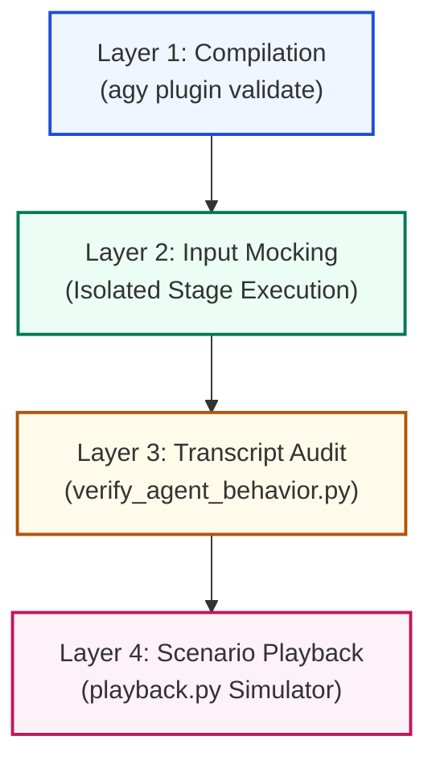

# ☕ Bean-to-Cup: Isolated Testing & Verification Strategy

Developing and expanding an autonomous swarm plugin requires a robust testing strategy. Unlike traditional deterministic software, testing AI agents involves verifying **state transitions, prompt boundaries, subagent delegation, and tool-use correctness**.

This document outlines the **Bean-to-Cup Isolation Testing Protocol**, enabling you to test every stage, skill, and subagent in absolute isolation without contaminating active project branches.

---

## 🗺️ Testing Strategy Overview

We test our agentic system at four distinct layers, moving from fast compilation checks to live interactive simulations:



---

## 🛠️ Layer 1: Compilation & Schema Validation

Before executing any agent logic, verify that all YAML frontmatter headers, skill parameters, subagent definitions, and session hooks comply with the `agy 2.0` schema.

```bash
# Verify entire workspace compilation
agy plugin validate .
```

**Expected Success Output:**
```text
  [ok]    .
          ✔ skills      : 20 processed
          ✔ agents      : 8 processed
          - commands    : skipped (not found)
          - mcpServers  : skipped (not found)
          ✔ hooks       : 1 processed
```

> [!NOTE]
> If any syntax error exists in your `SKILL.md` frontmatter or `.agents/agents.md`, this command will fail with a line reference and clear diagnostics, preventing runtime parsing exceptions.

---

## 📦 Layer 2: Isolated Workspace Gating (The Sandbox)

Never test active agent workflows directly in your production repository. Instead, create an isolated dummy target workspace where you can run the linked plugin safely.

### 1. Link Your Plugin in Development Mode
Run the installation script with the symlink option (`--link` or `-l`) so that the `agy` CLI points directly to your active development folder.

```bash
# Link plugin locally into workspace scope
./install.sh --link
```

### 2. Scaffold a Dummy Test Sandbox
Create a sandbox application outside your active folders (or inside the ignored `scratch/` folder):

```bash
# Create a dummy frontend/backend test repo
mkdir -p scratch/sandbox-app
cd scratch/sandbox-app
git init
git commit --allow-empty -m "chore: initial sandbox commit"
```

### 3. Open the Antigravity TUI inside the Sandbox
Launch `agy` inside your sandbox workspace. It will automatically load your symlinked `bean-to-cup` plugin, allowing you to run and debug actions in total safety.

---

## 📑 Layer 3: Input-Mocking for Stage Isolation

Each of the 10 SDLC stages expects the previous stage's artifact file to reside in the active plans folder. Because our stages are document-driven, **you can test any stage in isolation by simply writing a mock input file!**

This eliminates the need to run the entire pipeline from Stage 0 to test a late-stage implementation.

| Target Stage to Test | Active Skill / Subagent | Required Mock Input Files | Expected Output Artifact |
| :--- | :--- | :--- | :--- |
| **Stage 2: PRD** | `write-prd` | `plans/feature/test/01_GLOSSARY.md` | `02_PRD.md` |
| **Stage 3: Extraction** | `research` | `plans/feature/test/02_PRD.md` | `03_EXTRACTION.md` |
| **Stage 4: Spec** | `@architect` | `plans/feature/test/02_PRD.md`<br>`plans/feature/test/03_EXTRACTION.md` | `04_SPEC.md` |
| **Stage 5: Plan** | `@architect` | `plans/feature/test/04_SPEC.md` | `05_PLAN.md` |
| **Stage 7: TDD Loop** | `@engineer` / `@auditor` | `plans/feature/test/04_SPEC.md`<br>`plans/feature/test/05_PLAN.md` | `07_VERIFICATION.md` |
| **Stage 8: Walkthrough**| `asciinema` / `deploy-app` | `plans/feature/test/07_VERIFICATION.md` | `08_WALKTHROUGH.md` |

### Mocking Bootstrapper Example
To test **Stage 4 (Tech Spec)** in isolation, create a feature directory inside your sandbox workspace and seed it with dummy requirements:

```bash
# Create target plan path
mkdir -p scratch/sandbox-app/plans/feature/test-feature/20260619_1200/

# Seed mock requirements (02_PRD.md)
cat << 'EOF' > scratch/sandbox-app/plans/feature/test-feature/20260619_1200/02_PRD.md
# Product Requirements Document: Test Feature
## Problem Statement
We need an endpoint to retrieve the active barista queue status.
## Acceptance Criteria
- GET /api/barista/queue returns status 200 and list of active orders.
EOF

# Seed mock codebase facts (03_EXTRACTION.md)
cat << 'EOF' > scratch/sandbox-app/plans/feature/test-feature/20260619_1200/03_EXTRACTION.md
# Technical Extraction: Factual Codebase Map
## Endpoints
- `server.js:45` registers GET /api/health
- `models/queue.js:10` defines the Queue data structure
EOF
```

Now, launch your TUI or agent and prompt:
> "@architect, please read the PRD and Extraction report in `plans/feature/test-feature/20260619_1200/` and design the Technical Specification `04_SPEC.md`."

---

## 📊 Layer 4: Behavioral Assertions via Transcript Audit

To programmatically check that subagents are being called as expected, skills are being invoked, and tools are executing without errors, use our custom **Agent Behavioral Assertion Engine**.

The CLI generates a structured JSONL execution trace in the background under your conversation folder:
`<appDataDir>/brain/<conversation-id>/.system_generated/logs/transcript.jsonl`

### The Audit Script: `verify_agent_behavior.py`
We have provided an automated validation utility in `scripts/verify_agent_behavior.py`. This script reads the JSONL transcript, audits every planner response, and evaluates behavioral compliance.

#### Running the Audit:
Pass the path to your active session transcript to execute the assertion checker:

```bash
# Run assertions against current conversation transcript
python3 scripts/verify_agent_behavior.py ~/.gemini/antigravity-cli/brain/8feb1ff1-160f-4435-96a7-9eb5cdecd655/.system_generated/logs/transcript.jsonl
```

**Example Output:**
```text
Reading trace logs from: /home/robedwards/.gemini/antigravity-cli/brain/8feb1ff1-160f-4435-96a7-9eb5cdecd655/.system_generated/logs/transcript.jsonl

📊 --- Agent Behavior Audit Results ---
Total Transcript Steps Audited: 42
Tools Executed: list_dir, run_command, view_file, write_to_file
Subagents Dispatched: 3
  1. Role: 'Slice 1 Engineer' [Type: barista_builder]
  2. Role: 'Slice 2 Engineer' [Type: barista_builder]
  3. Role: 'Slice 3 Engineer' [Type: barista_builder]

✅ Assertion Check: Subagent spawning verified.
✅ Assertion Check: Zero tool errors or execution failures found.
```

> [!TIP]
> You can extend `scripts/verify_agent_behavior.py` to add custom domain-specific assertions, such as checking that `@auditor` is strictly triggered after `@engineer` completes, or that `write_to_file` is never executed during Stage 3 (Research).

---

## 🎬 Layer 5: Interactive & Automated Scenario Playback

For terminal-based or CLI-based testing, you can write scenario files (`.json`) containing simulated typing sequences and command outputs to test execution flows without manual typing.

### 1. Define a Playback Scenario
Create a test scenario file (e.g., `scratch/test_scenario.json`):

```json
{
  "prompt": "agy ☕ ",
  "steps": [
    {
      "type": "comment",
      "text": "# Verifying the compile status of the local plugin",
      "delay": 1.0
    },
    {
      "type": "command",
      "text": "agy plugin validate .",
      "delay": 2.0
    }
  ]
}
```

### 2. Run the Playback Engine
Execute the scenario using our integrated playback manager:

```bash
python3 scripts/playback.py scratch/test_scenario.json
```

This simulates the typing characters organic-by-character and executes the command in an isolated PTY (pseudo-terminal), capturing output formatting, logs, and interactive inputs exactly as a developer would.

---

## 📝 Swarm Expansion Testing Checklist

Whenever you add a new skill to `skills/` or a new subagent persona to `.agents/agents.md`, follow this 5-point checklist:

- [ ] **Lint and Validate:** Ensure `agy plugin validate .` returns `[ok]`.
- [ ] **Apache Header:** Verify the Google Apache 2.0 license block is at the top of any added files.
- [ ] **Context Isolation:** Check that any research-phase prompt does not mention the final feature goal (Context Firewall).
- [ ] **Silent on Success:** Ensure that verification execution commands return absolutely empty output on success, minimizing context bloating.
- [ ] **Dual-Write Documentation:** Update this strategy file and make sure it is mirrored cleanly in both the workspace (`docs/`) and the private artifacts folder (`/home/robedwards/.gemini/antigravity-cli/brain/<conv_id>/`).
