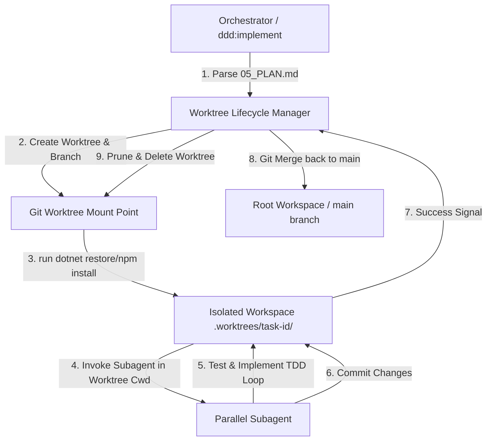

# ☕ Brew: Parallel Worktree Implementation (04_SPEC.md)

This technical specification details the architecture, file structures, Git commands, threat model, and telemetry logging for the Parallel Worktree and branch isolation engine.

---

## 1. System Architecture

The following diagram illustrates the relationship between the Orchestrator, the Worktree Lifecycle Manager, and the Parallel Subagents.



---

## 2. Component Design

### 2.1 Custom Command Interface
We will register a flat command in `commands/brew:worktree.toml` conforming to the AGY 2.0 schema:
*   **Command:** `agy brew:worktree`
*   **Arguments:**
    *   `--action <create|merge|clean>` (Required)
    *   `--task <id>` (Required for create/merge)
    *   `--slug <slug>` (Required for create)

### 2.2 Lifecycle Manager Script (`scripts/worktree_manager.py`)
A robust Python module responsible for executing the physical Git operations safely.

#### Create Action Lifecycle:
1. Validate `--task` and `--slug` inputs to prevent shell injection.
2. Ensure `.worktrees/` is added to `.gitignore`.
3. Check out the isolate branch: `git branch task/slice-<id>-<slug>`.
4. Add the Git Worktree: `git worktree add .worktrees/task-<id> task/slice-<id>-<slug>`.
5. Bootstrap dependencies inside the worktree directory: `dotnet restore` or `npm install --prefer-offline`.

#### Merge Action Lifecycle:
1. Enter a lock-file block to serialize merges (`.worktree_merge.lock`).
2. Inside the worktree path, stage and commit all modified files:
   ```bash
   git add -A && git commit -m "feat(slice-<id>): implement core code and tests"
   ```
3. Return to the root repository directory and merge the branch:
   ```bash
   git merge task/slice-<id>-<slug> --no-ff -m "merge: integrate slice-<id>"
   ```
4. Remove and prune the worktree:
   ```bash
   git worktree remove --force .worktrees/task-<id>
   git worktree prune
   ```
5. Delete the local branch: `git branch -d task/slice-<id>-<slug>`.
6. Release the merge lock.

#### Clean/Reconciliation Action Lifecycle:
1. Run `git worktree prune`.
2. Inspect the `.worktrees/` directory. For any folder that does not correspond to an active process ID, execute `git worktree remove --force <path>` and delete the physical directory.

---

## 3. Threat Model & Security Controls

| Threat Target | Vector / Vulnerability | Mitigating Security Control |
| :--- | :--- | :--- |
| **Shell Injection** | Malicious `--slug` input containing characters like `; rm -rf /` or `&`. | Strictly sanitize task IDs and slugs using a rigid regex whitelist (`^[a-zA-Z0-9\-_]+$`) inside Python before passing them to any subprocess calls. |
| **Workspace Escape** | Subagent or command referencing paths outside the workspace directory (e.g., `/tmp` or `/home`). | All directory checks are run against `os.path.abspath()` to ensure the worktree mount point lies strictly within the parent repository boundaries. |
| **Resource Bloat** | Dangling worktrees consuming large amounts of disk space or leaving Git in a locked branch state. | Proactive reconciliation scan on session startup (`SessionStart` hook) cleans up orphaned worktree directories. |

---

## 4. Telemetry & Audibility

To ensure transparency, all worktree activities will log structured JSON logs to `plans/feature/20260618-parallel-worktree-agents/worktree_telemetry.log`.

### Example Log Entry:
```json
{
  "timestamp": "2026-06-18T22:15:00Z",
  "task_id": "slice-04",
  "action": "create",
  "branch": "task/slice-04-auth",
  "worktree_path": ".worktrees/task-04",
  "status": "success",
  "duration_ms": 1240
}
```
