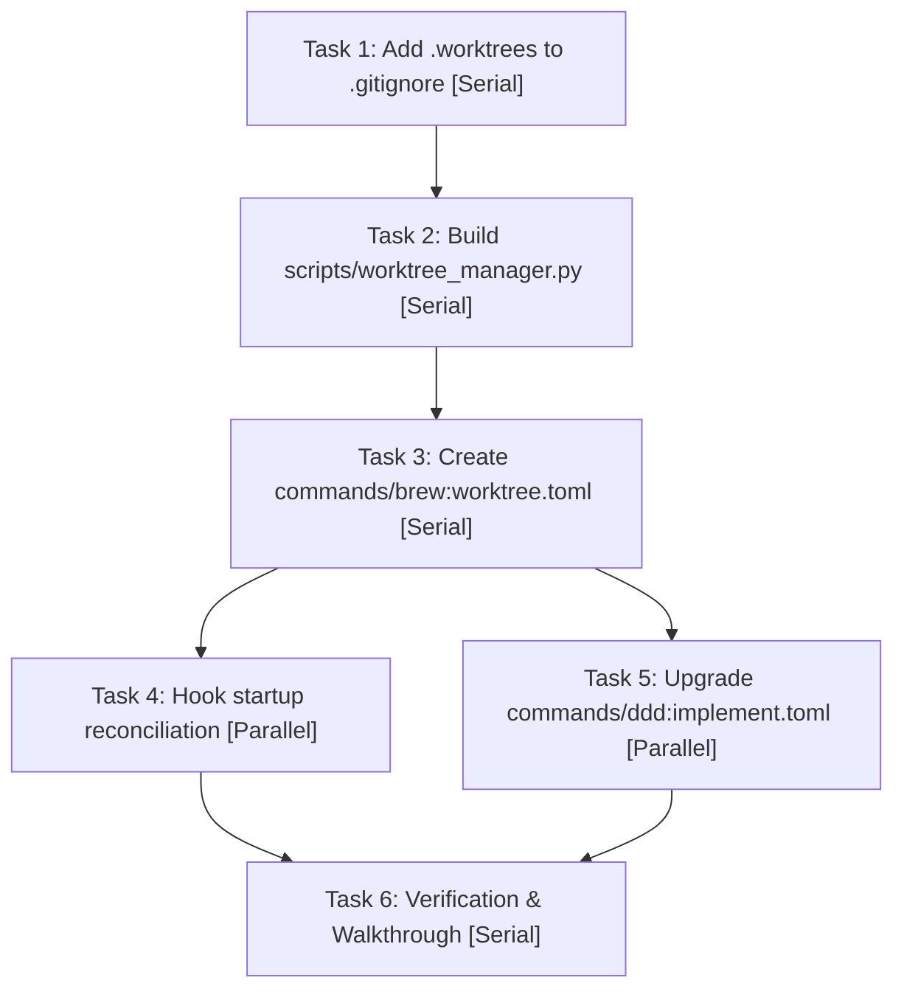

# ☕ Brew: Parallel Worktree Implementation (05_PLAN.md)

This execution plan outlines the vertical slices, physical contracts, and dependency graph for implementing the Parallel Worktree isolation system.

---

## 1. Dependency Graph (Parallel vs. Serial)

The following checklist details the implementation sequence. Tasks marked `[Serial]` must be executed sequentially, while `[Parallel]` tasks have no cross-dependencies and can be run concurrently.

---

## 2. Implementation Checklist

### Phase A: Core Isolation Engine
- [ ] **Task 1: Add `.worktrees/` to `.gitignore` `[Serial]`**
    *   *Contract:* Add `.worktrees/` line to workspace `.gitignore` file.
    *   *Verification:* Ensure `git status` does not track `.worktrees/` directory or its subcontents.
- [ ] **Task 2: Build `scripts/worktree_manager.py` `[Serial]`**
    *   *Contract:* A self-contained Python script implementing `--action <create|merge|clean>`, `--task`, `--slug`, full input regex sanitization, and structured JSON logs to `plans/feature/20260618-parallel-worktree-agents/worktree_telemetry.log`.
    *   *Verification:* Run unit tests exercising all three actions under mock git sub-process environments.

### Phase B: CLI Integration
- [ ] **Task 3: Register `commands/brew:worktree.toml` `[Serial]`**
    *   *Contract:* Declare command flat namespace, parameters, and help prompts mapped directly to `scripts/worktree_manager.py`.
    *   *Verification:* Verify command syntax and run `agy plugin validate .` to ensure schema compliance.
- [ ] **Task 4: Integrate Startup Reconciliation Hook `[Parallel]`**
    *   *Contract:* Add clean action invocation to startup hooks (e.g. `hooks.json` or within `hooks/git-status.sh`).
    *   *Verification:* Start a new session or run the hook script to confirm orphaned worktrees are successfully pruned.
- [ ] **Task 5: Upgrade `commands/ddd:implement.toml` to Use Worktrees `[Parallel]`**
    *   *Contract:* Modify implementation prompt logic to call `agy brew:worktree --action create` before spawning each subagent, and `agy brew:worktree --action merge` upon success.
    *   *Verification:* Validate ddd:implement execution loop schema.

### Phase C: Final Validation & Delivery
- [ ] **Task 6: Verification & Walkthrough `[Serial]`**
    *   *Contract:* Create `08_WALKTHROUGH.md` demonstrating dual-agent concurrent runs passing TDD, with asciinema recordings capturing isolation, clean-ups, and failure rollbacks.
    *   *Verification:* Compile a recording (`walkthrough_scenario.json`) and run `brew:record`.
