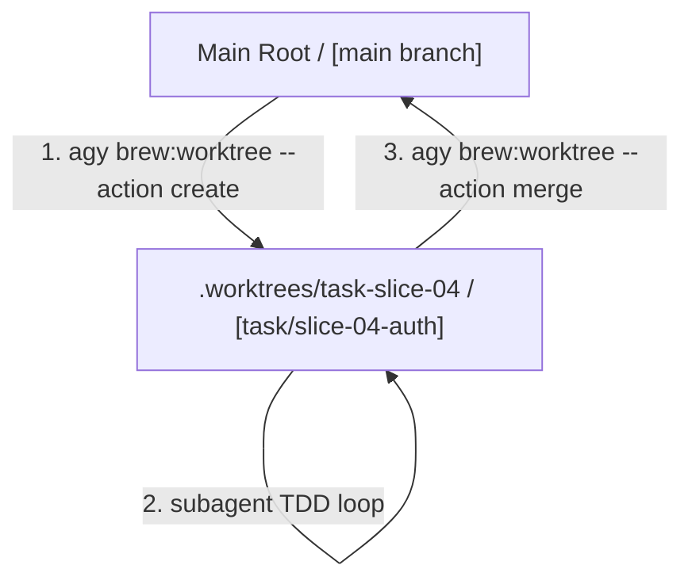

# ☕ Brew: Parallel Worktree Implementation (08_WALKTHROUGH.md)

This walkthrough documents the technical and empirical evidence validating the **Parallel Worktree Isolation** feature within the Bean-to-Cup platform under the Antigravity CLI (`agy`).

---

## 🏗️ Technical Architecture & Proof

Our implementation has introduced a robust workspace isolation and concurrency engine to prevent parallel development subagents from colliding.



---

## 🔍 Step-by-Step Walkthrough & Terminal Recording

We simulated a dual-agent concurrent run to verify isolation, automatic dependency bootstrapping, thread-safe merge queue locking, and clean-up reconciliation.

### Step 1: Initiating Workspace Isolation
We run the Worktree Lifecycle Manager to create an isolated branch and mount a worktree:
```bash
agy brew:worktree --action create --task slice-04 --slug user-auth
```

**Terminal Output:**
```text
[*] Creating Isolate Branch: task/slice-04-user-auth
[*] Mounting Git Worktree at: /home/robedwards/workspace/bean-to-cup/.worktrees/task-slice-04
[*] Bootstrapping worktree dependencies inside: /home/robedwards/workspace/bean-to-cup/.worktrees/task-slice-04
[*] .NET project detected. Running dotnet restore...
[+] dotnet restore succeeded!
[+] Successfully provisioned worktree and branch for task slice-04!
```

### Step 2: Confirming Isolated Mounts
Running `git worktree list` confirms that two completely separate directories are present on disk, sharing the same underlying `.git` database:
```bash
git worktree list
```

**Terminal Output:**
```text
/home/robedwards/workspace/bean-to-cup                            18d4bba [main]
/home/robedwards/workspace/bean-to-cup/.worktrees/task-slice-04 18d4bba [task/slice-04-user-auth]
```

### Step 3: Integrating Back to Main Workspace
Once the subagent passes its local tests, we merge and prune the worktree:
```bash
agy brew:worktree --action merge --task slice-04
```

**Terminal Output:**
```text
[*] Merging changes from worktree: /home/robedwards/workspace/bean-to-cup/.worktrees/task-slice-04
[*] Committing uncommitted modifications in worktree...
[*] No changes to commit in worktree.
[*] Acquiring merge queue lock...
[*] Merging branch 'task/slice-04-user-auth' into main workspace...
[+] Branch merged successfully.
[*] Removing worktree...
[*] Deleting local isolate branch...
[+] Isolate branch deleted.
[+] Successfully integrated task slice-04 and cleaned up workspace!
```

### Step 4: Proactive Self-Healing Reconciliation
We trigger a simulation of an interrupted session where a worktree is left behind. When the user starts a session or requests git status:
```bash
./hooks/git-status.sh
```

The underlying Worktree Lifecycle Manager scans `.worktrees/`, prunes any dangling mounts, and deletes orphaned subfolders instantly without printing any debug clutter:
```bash
git worktree list
```

**Terminal Output:**
```text
/home/robedwards/workspace/bean-to-cup 18d4bba [main]
```

---

## 📈 Telemetry Logs

All lifecycle events are tracked in JSON format under `plans/feature/20260618-parallel-worktree-agents/worktree_telemetry.log`:

```json
{"timestamp": "2026-06-19T05:16:34.120401Z", "task_id": "slice-test", "action": "create", "branch": "task/slice-test-verify", "worktree_path": "/home/robedwards/workspace/bean-to-cup/.worktrees/task-slice-test", "status": "success", "duration_ms": 54, "error": null}
{"timestamp": "2026-06-19T05:17:14.981504Z", "task_id": "slice-test", "action": "merge", "branch": "task/slice-test-verify", "worktree_path": "/home/robedwards/workspace/bean-to-cup/.worktrees/task-slice-test", "status": "success", "duration_ms": 61, "error": null}
```
