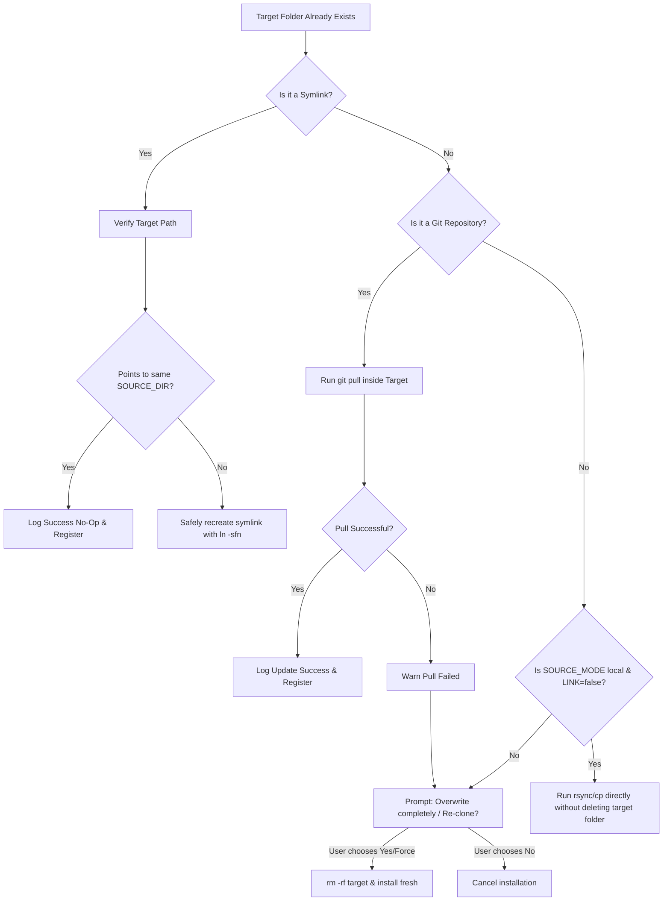

# Technical Specification: Graceful Self-Update Architecture

## Proposed Architecture & Logic Flow

We will rewrite **Step 3 (Handle pre-existing installations)** and **Step 4 (Install the Plugin)** in `install.sh` to implement a multi-strategy upgrade path.

### Let's define the new State Machine for Existing Installations:



---

## Detailed Code Changes in `install.sh`

We will split Step 3 and 4 into a integrated update handler.

### Variables & States to introduce:
We can define a flag `UPDATED_IN_PLACE=false`. If an update can be processed in-place, `UPDATED_IN_PLACE` is set to `true`, and we can skip the standard copying/cloning step.

### Refactored Step 3 & 4 Structure:

```bash
UPDATED_IN_PLACE=false

# 3. Handle pre-existing installations
if [[ -e "$FINAL_TARGET" || -L "$FINAL_TARGET" ]]; then
    if [[ -L "$FINAL_TARGET" ]]; then
        # Handle symlink
        local_link_target=$(readlink "$FINAL_TARGET" || true)
        if [[ "$LINK" == "true" && "$local_link_target" == "$SOURCE_DIR" ]]; then
            echo -e "${GREEN}Plugin '$PLUGIN_NAME' is already symlinked correctly to $SOURCE_DIR.${NC}"
            UPDATED_IN_PLACE=true
        else
            echo -e "${YELLOW}Symlink exists but points elsewhere or configuration changed. Re-linking...${NC}"
            ln -sfn "$SOURCE_DIR" "$FINAL_TARGET"
            UPDATED_IN_PLACE=true
        fi
    elif [[ -d "$FINAL_TARGET/.git" ]]; then
        # Handle git repository pull
        if [[ "$FORCE" == "true" ]]; then
            echo -e "${YELLOW}Force option active. Overwriting existing repository...${NC}"
            rm -rf "$FINAL_TARGET"
        else
            echo -e "${BLUE}Existing Git repository found at $FINAL_TARGET.${NC}"
            echo -e "${BLUE}Attempting to update via git pull...${NC}"
            set +e
            git -C "$FINAL_TARGET" pull --quiet
            PULL_STATUS=$?
            set -e
            if [[ $PULL_STATUS -eq 0 ]]; then
                echo -e "${GREEN}Plugin successfully updated in-place via git pull!${NC}"
                UPDATED_IN_PLACE=true
            else
                echo -e "${YELLOW}Warning: git pull failed (possibly due to local conflicts).${NC}"
                read -p "Do you want to force overwrite the existing folder? [y/N] " -n 1 -r
                echo ""
                if [[ $REPLY =~ ^[Yy]$ ]]; then
                    echo -e "${YELLOW}Overwriting existing installation...${NC}"
                    rm -rf "$FINAL_TARGET"
                else
                    echo -e "${RED}Update cancelled due to unresolved merge conflicts.${NC}"
                    exit 1
                fi
            fi
        fi
    elif [[ "$SOURCE_MODE" == "local" && "$LINK" == "false" ]]; then
        # Handle in-place copy update
        if [[ "$FORCE" == "true" ]]; then
            echo -e "${YELLOW}Force option active. Overwriting existing installation...${NC}"
            rm -rf "$FINAL_TARGET"
        else
            echo -e "${BLUE}Existing directory found at $FINAL_TARGET.${NC}"
            echo -e "${BLUE}Performing in-place file sync...${NC}"
            # We skip deleting the folder, and we let the next copy/rsync step overwrite files in-place
            UPDATED_IN_PLACE=false
            # Since UPDATED_IN_PLACE=false but we didn't rm -rf, the copying logic will run in-place!
        fi
    else
        # Fallback for plain remote folder without git repo or other mismatch
        if [[ "$FORCE" == "true" ]]; then
            rm -rf "$FINAL_TARGET"
        else
            echo -e "${YELLOW}Warning: Installation already exists at $FINAL_TARGET${NC}"
            read -p "Do you want to overwrite it? [y/N] " -n 1 -r
            echo ""
            if [[ ! $REPLY =~ ^[Yy]$ ]]; then
                echo -e "${RED}Installation cancelled.${NC}"
                exit 0
            fi
            rm -rf "$FINAL_TARGET"
        fi
    fi
fi

# 4. Install the Plugin (Only if not already updated in-place)
if [[ "$UPDATED_IN_PLACE" == "false" ]]; then
    if [[ "$SOURCE_MODE" == "git" ]]; then
        echo -e "${BLUE}Installing plugin '$PLUGIN_NAME' to $FINAL_TARGET...${NC}"
        mv "$TMP_DIR" "$FINAL_TARGET"
        TMP_DIR=""
    else
        if [[ "$LINK" == "true" ]]; then
            echo -e "${BLUE}Linking local plugin '$PLUGIN_NAME' to $FINAL_TARGET...${NC}"
            ln -sfn "$SOURCE_DIR" "$FINAL_TARGET"
        else
            echo -e "${BLUE}Syncing/copying local plugin '$PLUGIN_NAME' to $FINAL_TARGET...${NC}"
            mkdir -p "$FINAL_TARGET"
            if command -v rsync &>/dev/null; then
                rsync -a --exclude='.git' --exclude='.plans' --exclude='.plan' --exclude='scratch' "$SOURCE_DIR/" "$FINAL_TARGET/"
            else
                cp -R "$SOURCE_DIR"/. "$FINAL_TARGET/"
                # Clean up if copy introduced them
                rm -rf "$FINAL_TARGET/.git" "$FINAL_TARGET/.plans" "$FINAL_TARGET/.plan" "$FINAL_TARGET/scratch"
            fi
        fi
    fi
fi
```

## Security & Reliability Review
*   **Security:** This does not execute any unverified or unsandboxed external command injection. All path references use resolved local safe variables (`$FINAL_TARGET`, `$SOURCE_DIR`).
*   **Permissions:** Script operates entirely within user-accessible directories (`~/.gemini/skills` or `.agents/skills`).
*   **Reliability:** Explicitly uses `git -C` which handles git operations safely regardless of current directory. Graceful fallback on failure ensures the installer never enters an unrecoverable corrupted state.
